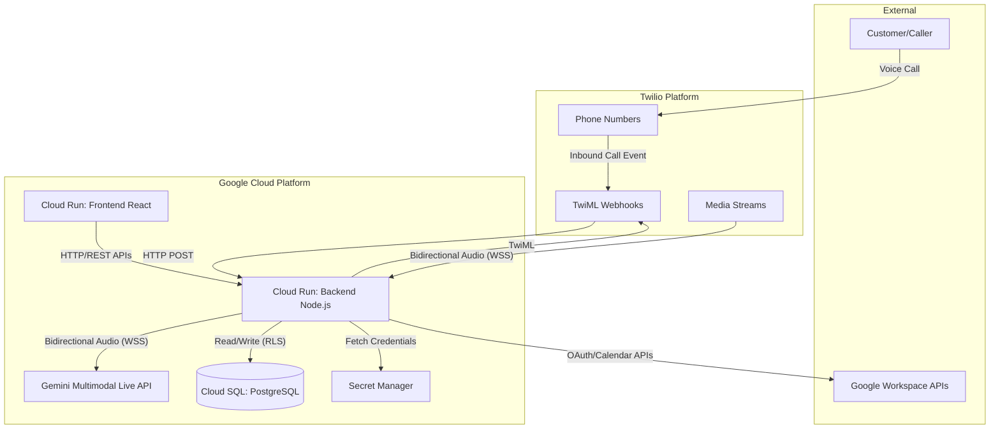
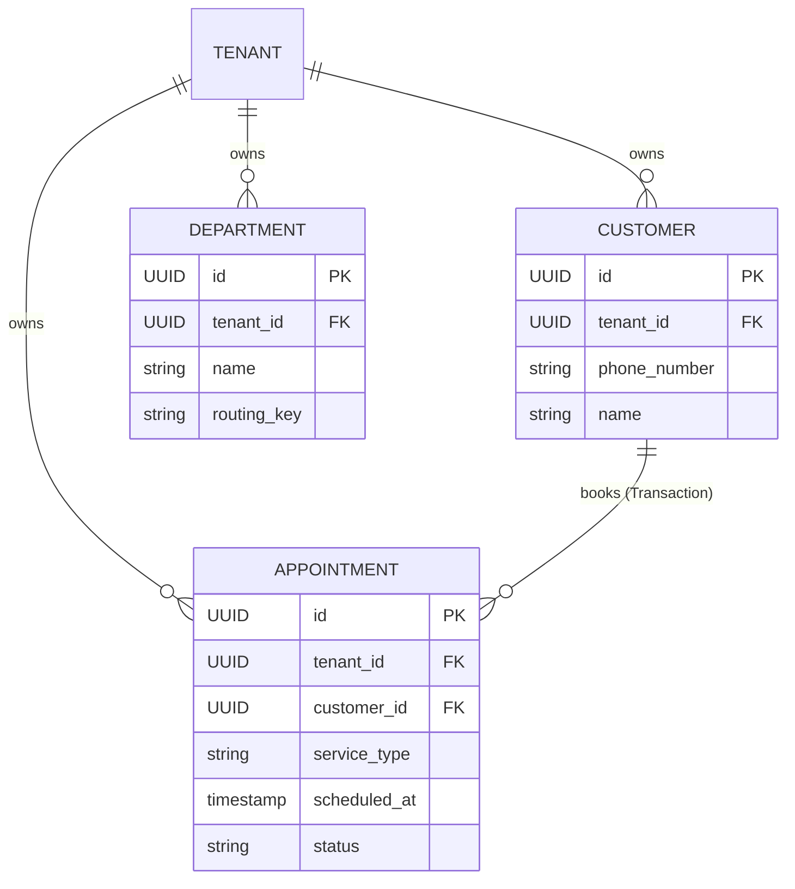
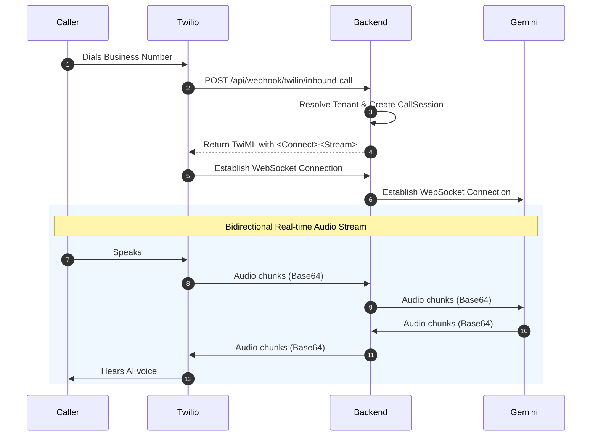
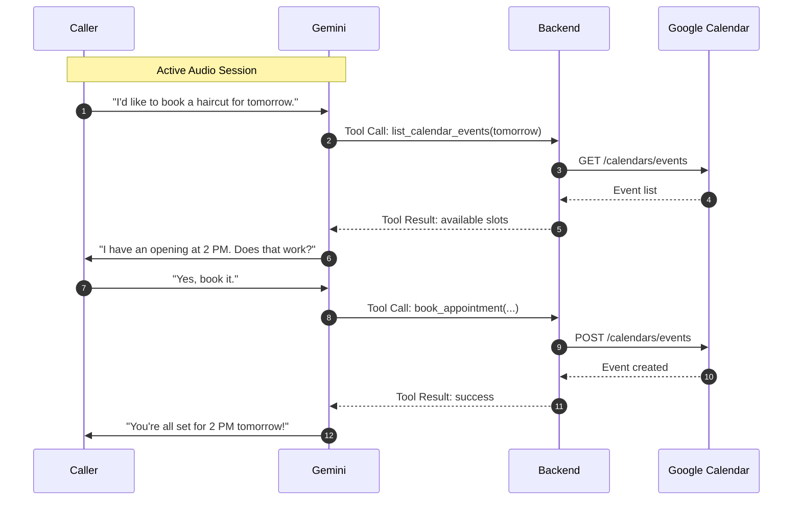
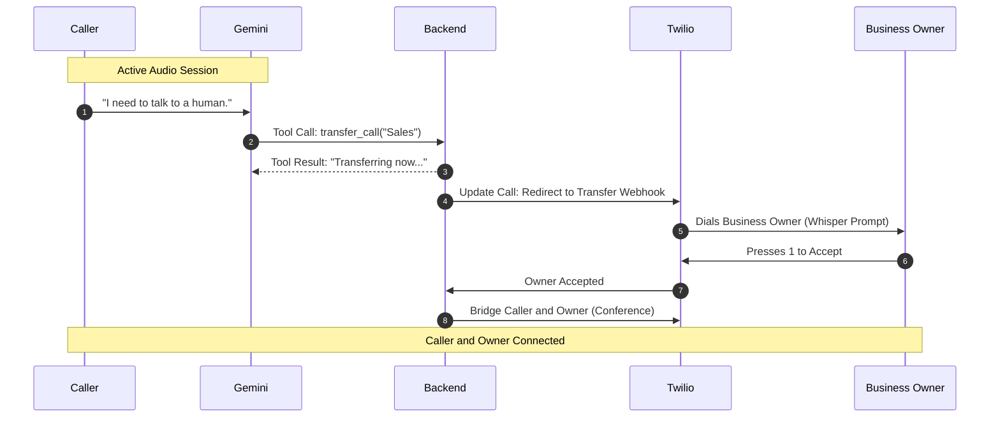
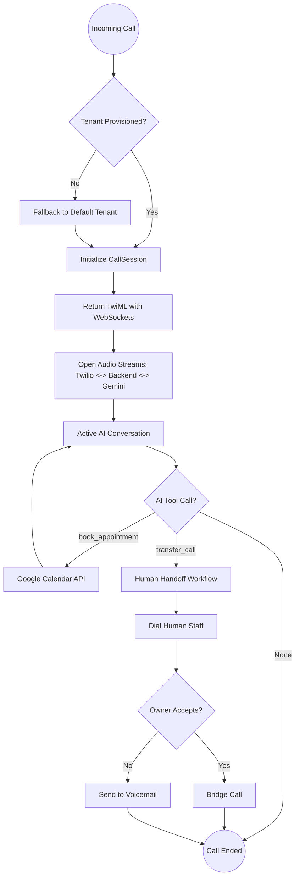

# Domain Model Design

*Authored by Architect, Domain Modeling Expert*

I have completed the domain model design based on Peter Coad's color archetypes to support the Oracle AI persona's function-calling tools. Here is the full architectural design.

### 1. Color Model Classification Table

| Archetype (Color) | Entity Name | Description |
| :--- | :--- | :--- |
| **Thing (Green)** | `Customer` | Core identity entity representing the caller/user in the CRM. Maintains its own lifecycle and holds identifying details like phone number. |
| **Transaction (Pink)** | `Appointment` | An interval of time (Moment-Interval) scheduled for a specific service. Represents a coordinated business process tied to a Customer. |
| **Descriptor (Blue)** | `Department` | A catalog entry used to characterize routing destinations (e.g., Support, Sales) for call transfers. Serves as a factory/descriptor for routing events. |

### 2. Entity Definitions

```typescript
// --- THING (Green) ---
export class Customer {
  constructor(
    public readonly id: string,
    public readonly tenantId: string, // Data Isolation Guard
    public readonly phoneNumber: string,
    public readonly name: string | null,
    public readonly createdAt: Date
  ) {}

  // Factory Method
  static create(tenantId: string, phoneNumber: string, name: string | null = null): Customer {
    return new Customer(
      crypto.randomUUID(),
      tenantId,
      phoneNumber,
      name,
      new Date()
    );
  }
}

// --- TRANSACTION (Pink) ---
export class Appointment {
  constructor(
    public readonly id: string,
    public readonly tenantId: string, // Data Isolation Guard
    public readonly customerId: string,
    public readonly serviceType: string,
    public readonly scheduledAt: Date,
    public readonly status: 'SCHEDULED' | 'COMPLETED' | 'CANCELLED',
    public readonly createdAt: Date
  ) {}

  // Factory Method
  static schedule(
    tenantId: string, 
    customerId: string, 
    serviceType: string, 
    scheduledAt: Date
  ): Appointment {
    return new Appointment(
      crypto.randomUUID(),
      tenantId,
      customerId,
      serviceType,
      scheduledAt,
      'SCHEDULED',
      new Date()
    );
  }
}

// --- DESCRIPTOR (Blue) ---
export class Department {
  constructor(
    public readonly id: string,
    public readonly tenantId: string, // Data Isolation Guard
    public readonly name: string,
    public readonly routingKey: string,
    public readonly active: boolean
  ) {}

  // Factory Method
  static create(tenantId: string, name: string, routingKey: string): Department {
    return new Department(
      crypto.randomUUID(),
      tenantId,
      name,
      routingKey,
      true
    );
  }
}
```

### 3. Schema Mappings

| TypeScript (CamelCase) | Database (snake_case) | Type / Constraints |
| :--- | :--- | :--- |
| **Customer** | `customers` | |
| `id` | `id` | `UUID PRIMARY KEY` |
| `tenantId` | `tenant_id` | `UUID NOT NULL` |
| `phoneNumber` | `phone_number` | `VARCHAR(50) NOT NULL` |
| `name` | `name` | `VARCHAR(255)` |
| `createdAt` | `created_at` | `TIMESTAMP WITH TIME ZONE` |
| **Appointment** | `appointments` | |
| `id` | `id` | `UUID PRIMARY KEY` |
| `tenantId` | `tenant_id` | `UUID NOT NULL` |
| `customerId` | `customer_id` | `UUID NOT NULL REFERENCES customers(id)`|
| `serviceType` | `service_type` | `VARCHAR(255) NOT NULL` |
| `scheduledAt` | `scheduled_at` | `TIMESTAMP WITH TIME ZONE NOT NULL` |
| `status` | `status` | `VARCHAR(50) NOT NULL` |
| `createdAt` | `created_at` | `TIMESTAMP WITH TIME ZONE` |
| **Department** | `departments` | |
| `id` | `id` | `UUID PRIMARY KEY` |
| `tenantId` | `tenant_id` | `UUID NOT NULL` |
| `name` | `name` | `VARCHAR(255) NOT NULL` |
| `routingKey` | `routing_key` | `VARCHAR(100) NOT NULL` |
| `active` | `active` | `BOOLEAN DEFAULT TRUE` |

### 4. Migration SQL

```sql
-- ==========================================
-- UP MIGRATION
-- ==========================================

-- DEPARTMENTS (Descriptor)
CREATE TABLE departments (
    id UUID PRIMARY KEY,
    tenant_id UUID NOT NULL,
    name VARCHAR(255) NOT NULL,
    routing_key VARCHAR(100) NOT NULL,
    active BOOLEAN DEFAULT TRUE,
    created_at TIMESTAMP WITH TIME ZONE DEFAULT NOW()
);
CREATE INDEX idx_departments_tenant ON departments(tenant_id);

-- CUSTOMERS (Thing)
CREATE TABLE customers (
    id UUID PRIMARY KEY,
    tenant_id UUID NOT NULL,
    phone_number VARCHAR(50) NOT NULL,
    name VARCHAR(255),
    created_at TIMESTAMP WITH TIME ZONE DEFAULT NOW(),
    CONSTRAINT uq_tenant_phone UNIQUE(tenant_id, phone_number)
);
CREATE INDEX idx_customers_tenant ON customers(tenant_id);
CREATE INDEX idx_customers_phone ON customers(tenant_id, phone_number);

-- APPOINTMENTS (Transaction)
CREATE TABLE appointments (
    id UUID PRIMARY KEY,
    tenant_id UUID NOT NULL,
    customer_id UUID NOT NULL REFERENCES customers(id) ON DELETE CASCADE,
    service_type VARCHAR(255) NOT NULL,
    scheduled_at TIMESTAMP WITH TIME ZONE NOT NULL,
    status VARCHAR(50) NOT NULL DEFAULT 'SCHEDULED',
    created_at TIMESTAMP WITH TIME ZONE DEFAULT NOW()
);
CREATE INDEX idx_appointments_tenant ON appointments(tenant_id);
CREATE INDEX idx_appointments_customer ON appointments(customer_id);
CREATE INDEX idx_appointments_schedule ON appointments(tenant_id, scheduled_at);


-- ==========================================
-- DOWN MIGRATION
-- ==========================================
DROP TABLE IF EXISTS appointments;
DROP TABLE IF EXISTS customers;
DROP TABLE IF EXISTS departments;
```

### 5. Architecture Overview



### 6. Entity Relationship Diagram



### 7. Sequence Diagrams

#### 7.1 Inbound Call Setup


#### 7.2 Appointment Booking Flow (Google Calendar)


#### 7.3 Human Handoff / Transfer Routing


### 8. Call Flow Workflow Diagram



### 9. Data Isolation Strategy

**Tenant Boundary Enforcement**
1. **Physical Schema Guard:** Every single domain table includes a `tenant_id` UUID column.
2. **Composite Uniqueness:** Constraints that would typically be globally unique (like a Customer's `phone_number`) are strictly scoped by a composite key `(tenant_id, phone_number)`.
3. **Query Layer Enforcement:** In the application's Data Access Layer (DAL) or ORM repository, every query must implicitly include `WHERE tenant_id = ?`. This guarantees that an appointment or customer query cross-pollinating into another tenant's workspace is impossible. 
4. **Index Optimization:** All tables have a leading index on `tenant_id` (or include it as the first parameter in composite indexes) to ensure that multitenant data retrieval is highly performant.
