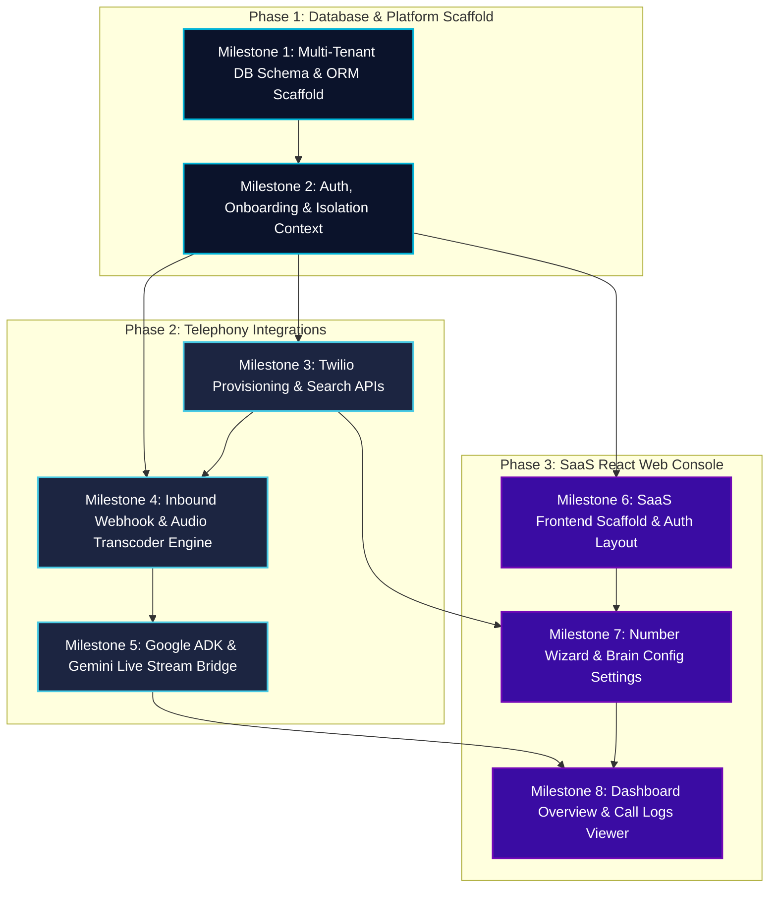

# Charlotte AI Virtual Receptionist — Multi-Tenant SaaS Backlog

This document establishes the comprehensive, high-fidelity engineering backlog for **Charlotte**, an AI-powered virtual receptionist. The backlog translates SaaS multi-tenant onboarding, billing, database schema, and inbound real-time telephony streaming requirements into logical, actionable, and user-centric **User Stories**.

For Phase 1, the backlog is optimized to deliver a **working, end-to-end MVP scenario pronto**:

1. A business owner signs up, creates a workspace, registers an available virtual phone number, and provides/verifies their personal **destination number** (e.g., mobile phone).
2. When a customer calls the virtual phone number, Charlotte answers: *"How can I direct your call?"*
3. When the customer requests a department (e.g. *"Sales"* or *"Customer Support"*), Charlotte identifies the routing intent, dials the business owner's destination number, announces the caller, and asks if they want to take the call.
4. If the owner accepts (e.g., says *"yes"* or presses 1), Charlotte bridges the calls, connecting the caller directly to the owner.

---

## 📋 Architectural Guardrails & Standards

To ensure software hygiene, structural stability, and data safety, the team MUST adhere to the following professional engineering guidelines across all milestones:

1. **Multi-Tenant Data Isolation (Dual-Layered)**
   - **Database Layer**: Every tenant-owned table MUST have PostgreSQL Row-Level Security (RLS) enabled. Queries MUST execute inside transaction blocks where session variables are bound: `SET LOCAL app.current_tenant_id = 'tenant-uuid'`.
   - **Application Layer**: Utilize Node.js `AsyncLocalStorage` to scope tenant contexts at request execution bounds, bypassing the need to pass ID parameters down through every repository class.

2. **Clean Domain & Persistence Mapping (No Decorators)**
   - Utilize **Mikro-ORM** with the PostgreSQL driver.
   - **Zero Decorators on Entities**: To keep domain models 100% clean of framework/ORM dependencies, **NEVER** import or use decorators (e.g., `@Entity`, `@Property`, `@PrimaryKey`, `@OneToMany`) inside the domain entity files. Entities must be pure TypeScript classes.
   - **Separated Schemas**: All persistence mappings must be defined entirely separately in companion schema files using Mikro-ORM **`EntitySchema`** classes (mapping properties, database columns, snake_case strategies, relations, and lifecycle hooks).
   - **Directory Structure**:
     - `src/domain/entities/`: Pure TypeScript classes with private constructors, private property fields, and static builder/factory operations (e.g., `src/domain/entities/User.ts`).
     - `src/domain/schemas/`: Companions containing ORM metadata schemas (e.g., `src/domain/schemas/User.schema.ts`).
   - **Example Reference (from Arachne)**:
     *Entity (src/domain/entities/User.ts)*:

     ```typescript
     import { randomUUID } from 'node:crypto';
     
     export class User {
       id!: string;
       email!: string;
       passwordHash!: string;
       createdAt!: Date;
     
       constructor(email: string, passwordHash: string) {
         this.id = randomUUID();
         this.email = email.toLowerCase();
         this.passwordHash = passwordHash;
         this.createdAt = new Date();
       }
     }
     ```

     *Schema (src/domain/schemas/User.schema.ts)*:

     ```typescript
     import { EntitySchema } from '@mikro-orm/core';
     import { User } from '../entities/User.js';
     
     export const UserSchema = new EntitySchema<User>({
       class: User,
       tableName: 'users',
       properties: {
         id: { type: 'uuid', primary: true },
         email: { type: 'string', columnType: 'varchar(255)', unique: true },
         passwordHash: { type: 'string', columnType: 'varchar(255)', fieldName: 'password_hash' },
         createdAt: { type: 'Date', fieldName: 'created_at', onCreate: () => new Date() },
       },
     });
     ```

3. **Engineering Process & Quality Gates**
   - **GitHub Flow**: Branch protection rules are active. Direct commits to `main` are strictly prohibited. Every modification must go through a feature branch and be merged via an authorized, peer-reviewed Pull Request (PR).
   - **MegaLinter Compliance**: All code (TS, SQL, CSS, JSON) must conform to strict MegaLinter static analysis checks.
   - **Code Coverage**: Newly added backend, domain, and database wrapper logic MUST achieve a **minimum of 80% code coverage** via comprehensive unit and integration tests.

4. **Telephony & AI Audio Transcoding**
   - Direct WebSocket streaming between Twilio (8kHz 8-bit G.711 μ-law) and Google Agent Development Kit (ADK) / Gemini Live API (16kHz PCM inbound / 24kHz PCM outbound).
   - All audio transcoding and sample rate interpolation MUST occur in-memory using optimized bitwise/buffer operations, never blocking the single-threaded Node.js event loop or calling slow CLI binary processes.

---

## 🗺️ Milestone Map & Dependency Hierarchy

To construct Charlotte logically, the technical tasks powering our discrete User Stories are organized into sequential milestones. Early milestones construct the schema foundations and isolation layers, followed by voice stream handlers, and finally the web client portal.



---

## 🗂️ Detailed Backlog Breakdown

### 📂 Feature Area 1: Multi-Tenant SaaS Onboarding & Account Setup

*Focuses on user registration, workspace setup, and registering the destination forwarding phone number.*

#### US-101: User Registration & Destination Number Setup

- **User Story**:
  - **As a** Business Owner,
  - **I want to** register for Charlotte, create my workspace, and provide/verify my destination phone number,
  - **So that** I have a secure tenant workspace and a verified destination number that my customer calls can be routed to.
- **Demonstrable Feature Value**:
  - The business owner signs up, inputs their business name, and provides a personal mobile destination number. The system verifies this number (e.g. via a quick Twilio Verification pin check or manual database verification bypass during sandbox testing) and redirects them to the number purchasing screen.
- **Acceptance Criteria**:

  ```gherkin
  Given a new visitor registering with email "owner@acme.com", password, business "Acme Corp", and destination number "+15125550100"
  When they submit the form
  Then an isolated Tenant organization is created, a User record is created with role "owner", a default AIReceptionistConfig is initialized, the destination number is saved, and a verification token transaction is dispatched.

  Given a pending destination number verification
  When the user inputs the correct 6-digit SMS verification PIN
  Then the destination number is marked as "verified" in the database under their tenant ID, and they are redirected to the Phone Line Search screen.
  ```

- **Technical & Architecture Tasks**:
  - *Task 1.1.1: Project Skeleton Scaffolding*: Setup Node + TS, package configuration, and Vitest testing framework.
  - *Task 1.1.2: PostgreSQL Schema SQL migrations (`up.sql`/`down.sql`)*: Design 15 tables supporting Peter Coad's 5-color archetype modeling. Include columns under `tenants` for `destination_number` and `destination_verified` (boolean). Enable PostgreSQL Row-Level Security (`ALTER TABLE ENABLE ROW LEVEL SECURITY`) and attach policies isolating queries based on `app.current_tenant_id` session settings. Create compound B-tree indexes starting with `tenant_id` on all high-scale transactional tables.
  - *Task 1.1.3: Decorator-Free Entities & EntitySchema Mappings*: Setup `src/domain/entities/` containing pure TS classes (`User.ts`, `Tenant.ts`, `Organization.ts`) with private constructors and static factory methods. Write companion mapping schemas in `src/domain/schemas/` using Mikro-ORM `EntitySchema`.
  - *Task 1.1.4: AsyncLocalStorage & RLS Isolation Middleware*: Implement middleware parsing JWT claims and binding context (`tenantId`, `userId`, `role`) into a request-scoped `AsyncLocalStorage` instance. Implement a database transaction wrapper that automatically runs `SET LOCAL app.current_tenant_id = ...` on the connection pool before query execution.
  - *Task 1.1.5: Onboarding Coordinator Saga*: Develop `TenantOnboardingCoordinator` transaction orchestration to guarantee atomic creation of User, Tenant, and Organization.
  - *Task 1.1.6: Twilio Verification Service Integration*: Code Twilio Verification REST API integration (SMS Verify Send / Check) to handle SMS PIN verifications for destination numbers.
  - *Task 1.1.7: React Auth and Registration Layouts*: Scaffold Vite React app, design premium index.css theme (Outfit/Inter fonts, dark modes), and implement registration forms (Login, Signup, and Destination Verification forms).

#### US-102: Virtual Phone Number Search & Purchasing

- **User Story**:
  - **As a** Tenant Administrator,
  - **I want to** search and purchase available local or toll-free telephone numbers,
  - **So that** my business has an active, virtual phone line callers can dial to reach my assistant.
- **Demonstrable Feature Value**:
  - Inside the dashboard, the Admin searches by area code (e.g. "512"), selects a number from a list showing costs, clicks "Provision," and views the new number added to their active phone lines grid.
- **Acceptance Criteria**:

  ```gherkin
  Given an authenticated Tenant Admin on the Phone Line Wizard screen
  When they search for local numbers in area code "512"
  Then the system queries Twilio AvailablePhoneNumbers REST API and displays a list of up to 10 available options with formatting, city, and pricing.

  Given an available phone number selected in the search grid
  When the admin clicks "Purchase," checks the carrier compliance box, and confirms
  Then the system programmatically provisions a Twilio Sub-Account, buys the number, registers our voice webhook POST URL on the number, saves a "TwilioPhoneNumber" record in the database under the active tenant ID, and displays a success toast.
  ```

- **Technical & Architecture Tasks**:
  - *Task 1.2.1: Available Numbers Search API*: Code Express endpoint `GET /api/tenants/numbers/search` integrating the Twilio REST client, verifying request parameters and tenant JWT context.
  - *Task 1.2.2: Programmatic Twilio Sub-account Provisioning Pipeline*: Code Express endpoint `POST /api/tenants/numbers/provision`. Programmatically spin up/retrieve Twilio Sub-accounts (Option B) for the tenant to isolate carrier logs and billing limits. Binds incoming voice callback POST URL.
  - *Task 1.2.3: BYON ("Bring Your Own Number") Database Readiness*: Define database schemas and Mikro-ORM mappings supporting conditional call forwarding and hosted carrier records.
  - *Task 1.2.4: Interactive Phone Number Wizard UI*: Build the step-by-step React phone search component, Available Numbers grid, and buy confirmation portal with timeout fallback loaders.

---

### 📂 Feature Area 2: Real-Time Inbound Calling & Conversational AI

#### US-201: Inbound Webhook Call Handshaking & Setup

- **User Story**:
  - **As an** Inbound Caller,
  - **I want to** dial the company's phone number and have the call accepted immediately by Charlotte,
  - **So that** my connection is established without encountering dead lines or busy signals.
- **Demonstrable Feature Value**:
  - The caller dials the virtual number. The line rings once, answers, and Charlotte speaks: *"How can I direct your call?"*
- **Acceptance Criteria**:

  ```gherkin
  Given a mobile caller dials a provisioned Charlotte phone number
  When the call triggers Twilio's webhook routing
  Then our system validates the Twilio HTTP POST request signature, queries the active tenant based on the dialed E.164 number, initializes a database CallSession in state "initiated", and returns valid TwiML instructions directing Twilio to stream audio to our WebSockets server.

  Given an incoming call request from an invalid or unauthenticated source
  When intercepted by the webhook
  Then the system rejects the call with HTTP "403 Forbidden" and plays no TwiML.
  ```

- **Technical & Architecture Tasks**:
  - *Task 2.1.1: Webhook Endpoints & Signature Security*: Build Express route `POST /api/webhook/twilio/inbound-call` implementing Twilio's webhook request validator.
  - *Task 2.1.2: Tenant-from-Number Resolution Cache*: Implement a Redis-backed lookup cache `TenantLookupService` that maps active E.164 phone numbers to `{ tenantId, status, config }` in sub-milliseconds to avoid initial Postgres table scans.

#### US-202: Department Directing Conversation

- **User Story**:
  - **As an** Inbound Caller,
  - **I want to** state the business department I want to talk to (e.g. Sales, Customer Support),
  - **So that** Charlotte understands my request and offers to forward my call.
- **Demonstrable Feature Value**:
  - When Charlotte asks *"How can I direct your call?"*, the caller says *"Sales"* or *"Customer Support"*. Charlotte detects this routing request, states: *"Sure, let me see if I can connect you to our Sales department. Please hold."* and triggers the outbound warm-transfer flow.
- **Acceptance Criteria**:

  ```gherkin
  Given a caller connected via WebSockets
  When Charlotte plays "How can I direct your call?" and the caller speaks "I would like to speak to Sales"
  Then the transcoded audio is sent to Gemini Live API via Google ADK, the model invokes a "routeCall" tool call with parameter { department: "Sales" }, and the server plays "Connecting you to Sales, please hold..." to the caller handset.
  ```

- **Technical & Architecture Tasks**:
  - *Task 2.2.1: In-Memory Bitwise Audio Transcoder*: Develop `services/transcoder.ts` converting 8kHz G.711 μ-law (Twilio) to 16kHz Linear PCM (Gemini) and 24kHz PCM (Gemini response) back to 8kHz μ-law.
  - *Task 2.2.2: Google ADK & Gemini Tool Definition*: Configure the `@google/adk` session. Define a structured Gemini Function Calling tool `routeCall(department: string)` which is triggered whenever the caller states a department request (Sales, Support, Billing, etc.).
  - *Task 2.2.3: Bidirectional WebSocket Streaming Bridge*: Build a real-time streaming server (`services/twilioStream.ts`) managing simultaneous WebSocket pipes to Twilio and Gemini Live, passing audio chunks.

---

### 📂 Feature Area 3: Warm Transfer & Call Bridging

#### US-301: Outbound Warm-Transfer Call Handoff

- **User Story**:
  - **As a** Business Owner,
  - **I want to** receive an outbound call from Charlotte announcing a caller and asking if I want to accept,
  - **So that** I can hear who is calling and explicitly decide whether to take the call or send them to voicemail.
- **Demonstrable Feature Value**:
  - When the caller requests a department, the business owner's mobile phone rings. On answering, Charlotte says: *"I have a customer calling for Sales. Would you like to take this call? Say yes or press 1 to accept."*
- **Acceptance Criteria**:

  ```gherkin
  Given a caller requests a department "Customer Support"
  When the backend intercepts the "routeCall" tool execution
  Then the system programmatically initiates an outbound Twilio Call to the tenant's verified "destination_number".

  Given the business owner answers the outbound call
  When Charlotte speaks the transfer prompt
  Then the owner says "yes" (or presses 1), and our system registers the acceptance state, transitioning the call state to "bridging".
  ```

- **Technical & Architecture Tasks**:
  - *Task 3.1.1: Outbound Forwarding Call Trigger*: Write backend service `TransferService.ts` utilizing the Twilio REST SDK to dial the active tenant's saved `destination_number` when a Gemini `routeCall` tool is received.
  - *Task 3.1.2: Handoff Whisper Prompt TwiML/TTS*: Write the TwiML route `POST /api/webhook/twilio/transfer-whisper` loaded on owner answer, playing the text-to-speech announcement and activating speech recognition/digit collection to detect owner acceptance.
  - *Task 3.1.3: User Interruption (Barge-in) Watcher*: Retain turn-detection code during conversation segments so that the caller can interrupt Charlotte's direction queries if needed.

#### US-302: Automated Call Bridging & Connection

- **User Story**:
  - **As an** Inbound Caller,
  - **I want to** be seamlessly connected to the business owner once they accept the call,
  - **So that** I can speak with them directly.
- **Demonstrable Feature Value**:
  - When the business owner says *"yes"* or presses 1, Charlotte says to the caller: *"Connecting you now!"* and the call is bridged, allowing the caller and owner to talk directly.
- **Acceptance Criteria**:

  ```gherkin
  Given the business owner has accepted the transfer on the outbound call
  When the transfer coordinator executes
  Then the system programmatically bridges the original inbound Twilio call (CallSid) and the outbound destination call (CallSid) together into a secure, low-latency Twilio Conference or Dial Bridge.

  Given the business owner declines the call (says "no" or presses 2) or fails to answer within 20 seconds
  When handled
  Then Charlotte plays: "I'm sorry, no one is available in Sales at the moment. Please leave a message after the beep." and records a voicemail session.
  ```

- **Technical & Architecture Tasks**:
  - *Task 3.2.1: Call Bridging Coordinator*: Implement Twilio REST command execution (updating Call configurations to bridge both Sids using `<Dial><Conference>` or custom routing endpoints).
  - *Task 3.2.2: Voicemail and Decline Fallbacks*: Implement TwiML fallbacks for declines and timeouts, playing record instructions and saving a `Voicemail` recording Sid.

---

### 📂 Feature Area 4: Call Auditing, Transcripts & Routing Logs

#### US-401: Call logs & Routing Transcripts Drawer

- **User Story**:
  - **As a** Tenant Administrator,
  - **I want to** view a log of calls showing routing outcomes (e.g. Completed, Transferred, Declined) and read the text transcript,
  - **So that** I can review caller inquiries and audit receptionist performance.
- **Demonstrable Feature Value**:
  - Inside the "Call Logs" dashboard, the Admin views a paginated grid. The "Outcome" column clearly lists *"Transferred to Destination"* or *"Voicemail".* Clicking "View" opens the slide-out drawer showing the caller's request and final routing actions.
- **Acceptance Criteria**:

  ```gherkin
  Given an authenticated Tenant Admin loading the Call Logs tab
  When the page loads
  Then it renders a searchable, paginated table of previous calls (caller number, date, duration, status, outcome) belonging strictly to their tenant ID.

  Given a specific call row in the logs table
  When the admin clicks "View"
  Then a slide-out drawer opens, displaying the call routing events (Dialed, Spoke to Charlotte, Transferred to Destination) and full alternating conversational transcripts.
  ```

- **Technical & Architecture Tasks**:
  - *Task 4.1.1: Call History and Transcript Logging Service*: Develop database loggers saving CallSession updates, routing outcomes, and speech utterances inside RLS transactions.
  - *Task 4.1.2: Tenant-Isolated REST API Endpoints*: Build secure Express endpoints: `GET /api/tenants/calls` and `GET /api/tenants/calls/:call_id/transcript` asserting strict RLS.
  - *Task 4.1.3: Interactive Analytics Dashboard UI*: Build React paginated call logs grids, outcome badges, metrics summary blocks (Transferred Calls Count, Voicemails Count), and the transcript drawer.
