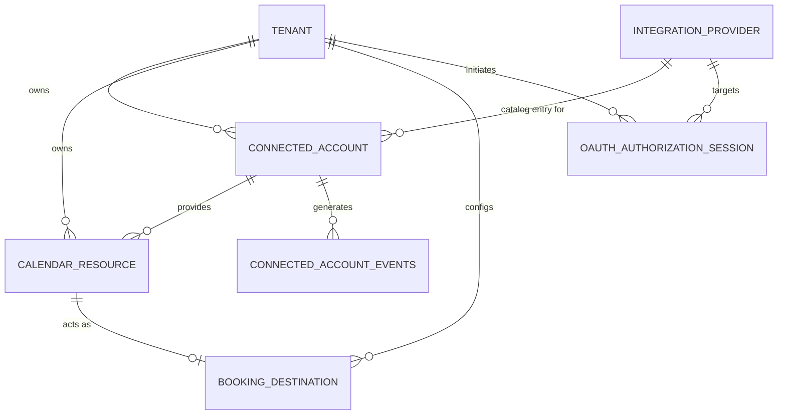

# Calendar Integration Domain Model

This document outlines the domain model for the Google Workspace / Third-Party Calendar integration in Charlotte, utilizing Peter Coad's five color archetypes to organize and architect the entities, roles, descriptors, events, and transactions.

## 1. Color Model Classification Table

| Archetype | Entity Name | Color | Description |
|-----------|-------------|-------|-------------|
| Descriptor | `IntegrationProvider` | Blue | Catalog of supported third-party integrations (e.g., Google Calendar, Microsoft Outlook). |
| Thing | `ConnectedAccount` | Green | An authenticated account for a specific Tenant and Provider, storing OAuth credentials (e.g., refresh token). |
| Thing | `CalendarResource` | Green | A specific remote calendar available within a `ConnectedAccount` (e.g., "Main Schedule", "Dr. Smith"). |
| Role | `BookingDestination` | Yellow | A `CalendarResource` that has been explicitly selected by the Tenant as an active target for reading availability and writing appointments. |
| Event | `ConnectedAccountAuthorized` | Orange | A historical record indicating when a `ConnectedAccount` was successfully authorized and linked to a Tenant. |
| Transaction | `OAuthAuthorizationSession` | Pink | A time-bound process tracking the OAuth authorization flow, including the `state` parameter to prevent CSRF. |

## 2. Entity Definitions

```typescript
import { randomUUID } from 'crypto';

// Descriptor (Blue)
export class IntegrationProvider {
  constructor(
    public readonly id: string,
    public name: string,
    public providerCode: string, // e.g., 'google_calendar', 'microsoft_graph'
    public authUrlBase: string,
    public tokenUrl: string,
    public clientId: string
  ) {}
}

// Thing (Green)
export class ConnectedAccount {
  constructor(
    public readonly id: string,
    public readonly tenantId: string,
    public providerId: string, // References IntegrationProvider
    public accountEmail: string,
    public encryptedRefreshToken: string,
    public isActive: boolean,
    public readonly createdAt: Date,
    public updatedAt: Date
  ) {}

  static create(
    tenantId: string,
    providerId: string,
    accountEmail: string,
    encryptedRefreshToken: string
  ): ConnectedAccount {
    return new ConnectedAccount(
      randomUUID(),
      tenantId,
      providerId,
      accountEmail,
      encryptedRefreshToken,
      true,
      new Date(),
      new Date()
    );
  }
}

// Thing (Green)
export class CalendarResource {
  constructor(
    public readonly id: string,
    public readonly tenantId: string,
    public readonly connectedAccountId: string,
    public remoteCalendarId: string,
    public name: string,
    public timezone: string,
    public isPrimary: boolean
  ) {}

  static create(
    tenantId: string,
    connectedAccountId: string,
    remoteCalendarId: string,
    name: string,
    timezone: string,
    isPrimary: boolean
  ): CalendarResource {
    return new CalendarResource(
      randomUUID(),
      tenantId,
      connectedAccountId,
      remoteCalendarId,
      name,
      timezone,
      isPrimary
    );
  }
}

// Role (Yellow)
export class BookingDestination {
  constructor(
    public readonly id: string,
    public readonly tenantId: string,
    public readonly calendarResourceId: string,
    public allowsReads: boolean, // Should Charlotte check availability here?
    public allowsWrites: boolean, // Should Charlotte book new appointments here?
    public priority: number,
    public readonly assignedAt: Date
  ) {}

  static assignTo(
    tenantId: string,
    calendarResourceId: string,
    allowsReads: boolean = true,
    allowsWrites: boolean = true
  ): BookingDestination {
    return new BookingDestination(
      randomUUID(),
      tenantId,
      calendarResourceId,
      allowsReads,
      allowsWrites,
      1,
      new Date()
    );
  }
}

// Transaction (Pink)
export class OAuthAuthorizationSession {
  constructor(
    public readonly id: string,
    public readonly tenantId: string,
    public readonly providerId: string,
    public stateParameter: string,
    public status: 'PENDING' | 'COMPLETED' | 'FAILED',
    public readonly expiresAt: Date,
    public readonly createdAt: Date
  ) {}

  static initiate(tenantId: string, providerId: string): OAuthAuthorizationSession {
    const expiresAt = new Date();
    expiresAt.setMinutes(expiresAt.getMinutes() + 15); // 15 min expiration for flow
    return new OAuthAuthorizationSession(
      randomUUID(),
      tenantId,
      providerId,
      randomUUID(), // cryptographically secure random state
      'PENDING',
      expiresAt,
      new Date()
    );
  }
}

// Event (Orange)
export class ConnectedAccountAuthorizedEvent {
  constructor(
    public readonly eventId: string,
    public readonly tenantId: string,
    public readonly connectedAccountId: string,
    public readonly providerId: string,
    public readonly timestamp: Date
  ) {}

  static record(account: ConnectedAccount): ConnectedAccountAuthorizedEvent {
    return new ConnectedAccountAuthorizedEvent(
      randomUUID(),
      account.tenantId,
      account.id,
      account.providerId,
      new Date()
    );
  }
}
```

## 3. Schema Definitions

```typescript
export const SchemaMappings = {
  IntegrationProvider: {
    tableName: 'integration_providers',
    columns: {
      id: 'id',
      name: 'name',
      providerCode: 'provider_code',
      authUrlBase: 'auth_url_base',
      tokenUrl: 'token_url',
      clientId: 'client_id'
    }
  },
  ConnectedAccount: {
    tableName: 'connected_accounts',
    columns: {
      id: 'id',
      tenantId: 'tenant_id',
      providerId: 'provider_id',
      accountEmail: 'account_email',
      encryptedRefreshToken: 'encrypted_refresh_token',
      isActive: 'is_active',
      createdAt: 'created_at',
      updatedAt: 'updated_at'
    }
  },
  CalendarResource: {
    tableName: 'calendar_resources',
    columns: {
      id: 'id',
      tenantId: 'tenant_id',
      connectedAccountId: 'connected_account_id',
      remoteCalendarId: 'remote_calendar_id',
      name: 'name',
      timezone: 'timezone',
      isPrimary: 'is_primary'
    }
  },
  BookingDestination: {
    tableName: 'booking_destinations',
    columns: {
      id: 'id',
      tenantId: 'tenant_id',
      calendarResourceId: 'calendar_resource_id',
      allowsReads: 'allows_reads',
      allowsWrites: 'allows_writes',
      priority: 'priority',
      assignedAt: 'assigned_at'
    }
  },
  OAuthAuthorizationSession: {
    tableName: 'oauth_authorization_sessions',
    columns: {
      id: 'id',
      tenantId: 'tenant_id',
      providerId: 'provider_id',
      stateParameter: 'state_parameter',
      status: 'status',
      expiresAt: 'expires_at',
      createdAt: 'created_at'
    }
  },
  ConnectedAccountEvent: {
    tableName: 'connected_account_events',
    columns: {
      eventId: 'event_id',
      tenantId: 'tenant_id',
      connectedAccountId: 'connected_account_id',
      providerId: 'provider_id',
      eventType: 'event_type',
      timestamp: 'timestamp'
    }
  }
};
```

## 4. Migration SQL (Up/Down)

```sql
-- =========================================
-- UP MIGRATION
-- =========================================

CREATE TABLE integration_providers (
    id UUID PRIMARY KEY,
    name VARCHAR(255) NOT NULL,
    provider_code VARCHAR(100) NOT NULL UNIQUE,
    auth_url_base TEXT NOT NULL,
    token_url TEXT NOT NULL,
    client_id TEXT NOT NULL
);

CREATE TABLE connected_accounts (
    id UUID PRIMARY KEY,
    tenant_id UUID NOT NULL,
    provider_id UUID NOT NULL REFERENCES integration_providers(id),
    account_email VARCHAR(255) NOT NULL,
    encrypted_refresh_token TEXT NOT NULL,
    is_active BOOLEAN DEFAULT true NOT NULL,
    created_at TIMESTAMP WITH TIME ZONE DEFAULT NOW() NOT NULL,
    updated_at TIMESTAMP WITH TIME ZONE DEFAULT NOW() NOT NULL
);
CREATE INDEX idx_connected_accounts_tenant_id ON connected_accounts(tenant_id);

CREATE TABLE calendar_resources (
    id UUID PRIMARY KEY,
    tenant_id UUID NOT NULL,
    connected_account_id UUID NOT NULL REFERENCES connected_accounts(id) ON DELETE CASCADE,
    remote_calendar_id TEXT NOT NULL,
    name VARCHAR(255) NOT NULL,
    timezone VARCHAR(100),
    is_primary BOOLEAN DEFAULT false NOT NULL
);
CREATE INDEX idx_calendar_resources_tenant_id ON calendar_resources(tenant_id);
CREATE INDEX idx_calendar_resources_account_id ON calendar_resources(connected_account_id);

CREATE TABLE booking_destinations (
    id UUID PRIMARY KEY,
    tenant_id UUID NOT NULL,
    calendar_resource_id UUID NOT NULL REFERENCES calendar_resources(id) ON DELETE CASCADE,
    allows_reads BOOLEAN DEFAULT true NOT NULL,
    allows_writes BOOLEAN DEFAULT true NOT NULL,
    priority INT DEFAULT 1 NOT NULL,
    assigned_at TIMESTAMP WITH TIME ZONE DEFAULT NOW() NOT NULL,
    UNIQUE(calendar_resource_id) -- A resource is only one destination at a time
);
CREATE INDEX idx_booking_destinations_tenant_id ON booking_destinations(tenant_id);

CREATE TABLE oauth_authorization_sessions (
    id UUID PRIMARY KEY,
    tenant_id UUID NOT NULL,
    provider_id UUID NOT NULL REFERENCES integration_providers(id),
    state_parameter TEXT NOT NULL UNIQUE,
    status VARCHAR(50) NOT NULL,
    expires_at TIMESTAMP WITH TIME ZONE NOT NULL,
    created_at TIMESTAMP WITH TIME ZONE DEFAULT NOW() NOT NULL
);
CREATE INDEX idx_oauth_sessions_tenant_id ON oauth_authorization_sessions(tenant_id);

CREATE TABLE connected_account_events (
    event_id UUID PRIMARY KEY,
    tenant_id UUID NOT NULL,
    connected_account_id UUID NOT NULL REFERENCES connected_accounts(id) ON DELETE CASCADE,
    provider_id UUID NOT NULL REFERENCES integration_providers(id),
    event_type VARCHAR(100) NOT NULL DEFAULT 'AUTHORIZED',
    timestamp TIMESTAMP WITH TIME ZONE DEFAULT NOW() NOT NULL
);
CREATE INDEX idx_account_events_tenant_id ON connected_account_events(tenant_id);

-- =========================================
-- DOWN MIGRATION
-- =========================================

DROP TABLE IF EXISTS connected_account_events;
DROP TABLE IF EXISTS oauth_authorization_sessions;
DROP TABLE IF EXISTS booking_destinations;
DROP TABLE IF EXISTS calendar_resources;
DROP TABLE IF EXISTS connected_accounts;
DROP TABLE IF EXISTS integration_providers;
```

## 5. Relationship Diagram



*(Note: `TENANT` is considered an external aggregate root from the perspective of this module, but all tenant relationships are strictly enforced via `tenant_id` foreign keys).*

## 6. Data Isolation Strategy

**Tenant Boundary Enforcement:**

1. **Mandatory `tenant_id` Columns:** Every operational table (`connected_accounts`, `calendar_resources`, `booking_destinations`, `oauth_authorization_sessions`, `connected_account_events`) strictly includes a `tenant_id` column to natively identify data ownership.
2. **Foreign Key Scoping:** Entities don't just reference their parents by parent ID; queries must consistently propagate and assert the `tenant_id` (`WHERE tenant_id = $1 AND id = $2`).
3. **Row-Level Security (RLS):** For robust isolation, Postgres Row-Level Security policies should be enforced on all tables.

   ```sql
   CREATE POLICY tenant_isolation_policy ON connected_accounts 
   USING (tenant_id = current_setting('app.current_tenant_id')::UUID);
   ```

   This guarantees that even if an application bug omits the `WHERE` clause, cross-tenant data leaks are mathematically impossible at the database level.
4. **Encryption with AAD:** The `encrypted_refresh_token` in `connected_accounts` must be encrypted at rest using a robust symmetric encryption algorithm (e.g., AES-256-GCM) with a securely managed KMS key. The `tenant_id` should be bound as Additional Authenticated Data (AAD) during the encryption of the refresh token. This guarantees that a stolen encrypted token from one tenant cannot be decrypted in the context of another tenant, serving as a secondary layer of isolation.
