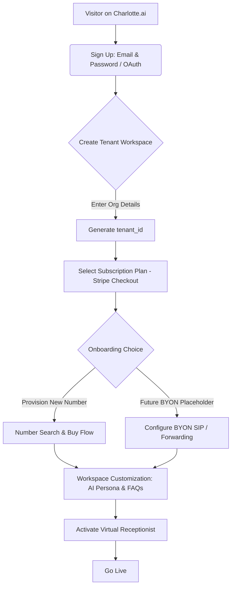
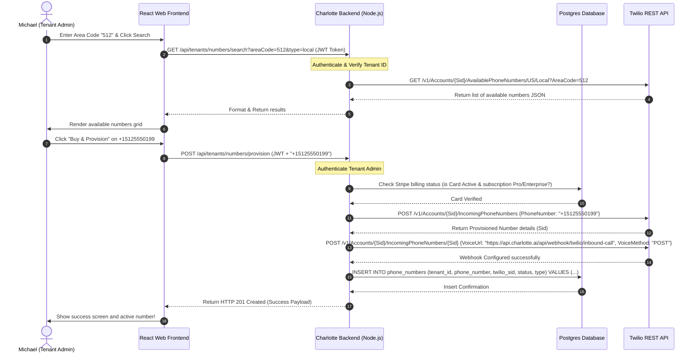
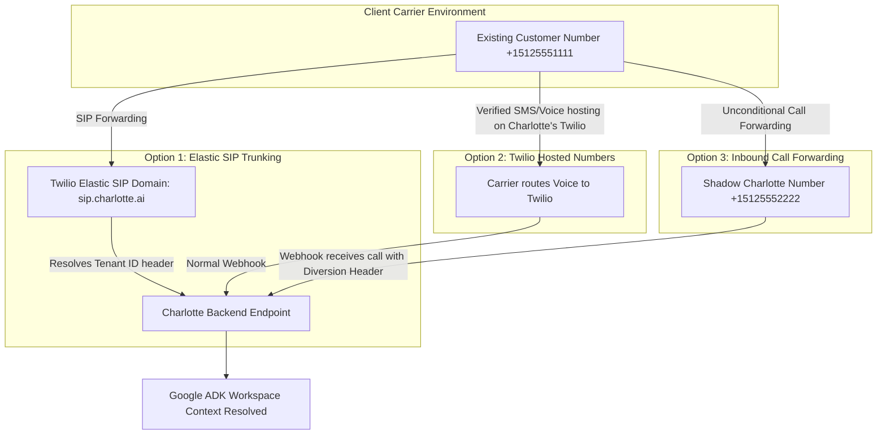

# Product Requirements Document (PRD)
# Charlotte Multi-Tenant SaaS Onboarding & Number Provisioning

## 1. Problem Statement
To scale Charlotte from a single-tenant virtual receptionist into a high-growth, self-service SaaS platform, we must build a frictionless onboarding experience. Currently, establishing a new virtual receptionist requires manual server, Twilio, and database configurations. 

To achieve massive scale, Charlotte must allow business owners to sign up via a web interface, instantly provision an isolated Tenant account, search for available local or toll-free phone numbers, purchase them via an automated Twilio pipeline, and have a live, AI-powered receptionist answering inbound calls in under 5 minutes. 

Furthermore, to successfully capture the mid-market and enterprise segments, Charlotte's underlying database and routing architecture must support a future **"Bring Your Own Number" (BYON)** feature. This allows organizations to keep their existing phone carriers and routing numbers while seamlessly sending voice traffic to Charlotte's Google ADK-powered AI agent.

---

## 2. Affected Personas

### Michael (Business Owner)
*   **Needs:** A fast, self-service way to set up an AI receptionist for his business. He wants to pick a local phone number matching his business location, link his credit card, upload his business FAQs, and have his phone line active immediately without waiting for custom deployment.
*   **Impact:** Zero onboarding friction, instant time-to-value, and total control over his active numbers, billing history, and agent configuration through a web dashboard.

### Caller (End Customer)
*   **Needs:** To call a standard, high-quality local or toll-free phone number and immediately reach an ultra-low latency, professional AI assistant that possesses deep, isolated knowledge of Michael's business.
*   **Impact:** A flawless calling experience with no routing delays, dropped streams, or cross-talk from other tenants.

---

## 3. Multi-Tenant Registration & User Signup Flows

To support a secure multi-tenant environment, Charlotte must strictly isolate data, logs, and configurations across workspaces. 



### 3.1. Tenant Registration & Authentication
*   **REQ-3.1.1 (Identity Provider Integration):** The frontend MUST leverage a secure Identity Provider (specifically Google Cloud Identity Platform or Google Cloud OAuth) to manage user credentials, multi-factor authentication (MFA), and password resets.
*   **REQ-3.1.2 (Tenant Account Creation):** Upon registration, the backend MUST generate a unique, non-guessable UUID `tenant_id` representing the business's data isolation boundary.
*   **REQ-3.1.3 (Role-Based Access Control):** Every user account MUST be bound to a `tenant_id` via a pivot table. The system MUST support at least three roles:
    *   `Owner`: Full billing, member management, agent setup, and number provisioning capabilities.
    *   `Admin`: Full agent setup and number management; cannot modify billing details or delete the workspace.
    *   `Member`: Read-only access to call logs and metrics; cannot change settings.
*   **REQ-3.1.4 (Secure JWT Authentication):** All API calls between the React frontend and Charlotte backend MUST be secured via JWTs containing the authenticated user's `tenant_id` and `role` as secure claims.
*   **REQ-3.1.5 (Strict Data Isolation):** Every database table storing application state (e.g., sessions, call logs, FAQs, configurations) MUST contain a `tenant_id` column with a database foreign key constraint. All SQL/ORM queries MUST explicitly append a `WHERE tenant_id = current_tenant_id` filter to prevent cross-tenant leakage.

---

## 4. Web Frontend Interface Pages

The React-based web console must provide an intuitive interface for Michael to manage his workspace.

### 4.1. Dashboard (Overview Page)
*   **REQ-4.1.1 (High-Level Metrics):** The dashboard MUST display key performance indicators (KPIs) aggregated for the selected billing cycle:
    *   *Total Inbound Calls* (integer)
    *   *Average Call Duration* (minutes/seconds)
    *   *Receptionist Answer Rate* (percentage)
    *   *Total Billing Usage* (USD and active minutes)
*   **REQ-4.1.2 (Active Numbers Widget):** Lists all active phone lines pointing to this workspace with a status indicator (Active / Inactive) and a toggle to temporarily suspend incoming routing.
*   **REQ-4.1.3 (Call Logs & Transcripts Viewer):** A searchable table listing call records. Clicking a record MUST open an overlay displaying the full text transcript of the call, audio recordings (if enabled), and any structured messages/contact details collected by the AI.

### 4.2. Number Search & Selection Page
*   **REQ-4.2.1 (Search Interface Filters):** The search interface MUST include:
    *   *Country Code Selector* (Dropdown, defaults to US/CA)
    *   *Number Type Filter* (Toggle between "Local" and "Toll-Free")
    *   *Area Code Filter* (3-digit numeric input for local searches)
    *   *Keypad Matching Query* (Alphanumeric text box for vanity/custom character lookups, e.g., "TAXI")
*   **REQ-4.2.2 (Available Numbers Grid):** A clean results table displaying:
    *   Formatted phone number (e.g., `(512) 555-0199`)
    *   Location / City mapping
    *   Monthly recurring cost (e.g., `$1.15/mo`)
    *   One-time provisioning cost (e.g., `$1.00`)
*   **REQ-4.2.3 (Provisioning Confirmation Modal):** Clicking "Buy & Provision" MUST open a modal outlining:
    *   The exact phone number selected.
    *   The immediate charge and recurring monthly cost.
    *   A mandatory terms-of-service agreement checkbox for telecom compliance.
    *   A progress spinner that remains active while the backend Twilio provisioning pipeline executes synchronously (max timeout: 15 seconds).

### 4.3. Settings & Phone Numbers Manager
*   **REQ-4.3.1 (Organization Settings):** Allows modifying business profile details (business name, primary contact, timezone).
*   **REQ-4.3.2 (Receptionist Customization):** Editor for system prompt rules, greeting messages, FAQs context, transfer phone numbers (for live human escalation), and third-party calendar sync configurations (Google/Outlook).
*   **REQ-4.3.3 (Numbers Manager Tab):** A dedicated interface displaying active lines:
    *   **Provisioned Numbers:** Displaying Twilio SIP connection statuses.
    *   **BYON Section:** A button to launch the **"Bring Your Own Number Wizard"**.
*   **REQ-4.3.4 (Billing Portal Link):** A button that securely redirects the user to a Stripe Customer Billing Portal for managing payment cards, invoices, and active subscription packages.

---

## 5. Twilio Automated Phone Number Search & Provisioning Pipeline

The backend must act as a secure, automated coordinator with Twilio APIs to search, buy, configure, and register numbers.

### 5.1. Twilio Integration Sequence



### 5.2. Detailed API Endpoint Specifications

#### 5.2.1. Search Available Numbers
*   **Endpoint:** `GET /api/tenants/numbers/search`
*   **Authentication:** Bearer JWT token required in headers.
*   **Query Parameters:**
    *   `country` (string, optional, default: `'US'`)
    *   `type` (string, required: `'local'` or `'tollFree'`)
    *   `areaCode` (string, conditional, required if `type` is `'local'`)
    *   `contains` (string, optional, character pattern matching)
*   **Backend Logic:**
    1. Extract `tenant_id` from JWT.
    2. Call the Twilio AvailablePhoneNumbers API via the Twilio Node.js SDK:
       ```typescript
       import { Twilio } from 'twilio';
       const client = new Twilio(process.env.TWILIO_ACCOUNT_SID, process.env.TWILIO_AUTH_TOKEN);
       
       let results;
       if (type === 'local') {
         results = await client.availablePhoneNumbers(country).local.list({ areaCode, limit: 10 });
       } else {
         results = await client.availablePhoneNumbers(country).tollFree.list({ limit: 10 });
       }
       ```
    3. Format Twilio response into a clean JSON structure and return with a standard `200 OK`.

#### 5.2.2. Provision and Configure Number
*   **Endpoint:** `POST /api/tenants/numbers/provision`
*   **Authentication:** Bearer JWT token required (role must be `Owner` or `Admin`).
*   **Request Body:**
    ```json
    {
      "phoneNumber": "+15125550199"
    }
    ```
*   **Backend Logic:**
    1. Extract `tenant_id` and user role from JWT. Validate execution permissions.
    2. Check the database to ensure the Tenant has an active, valid Stripe subscription and is under their allowed active phone numbers quota limit.
    3. Call the Twilio SDK to purchase the number:
       ```typescript
       const provisioned = await client.incomingPhoneNumbers.create({
         phoneNumber: req.body.phoneNumber,
         voiceUrl: `${process.env.CHARLOTTE_API_BASE_URL}/api/webhook/twilio/inbound-call`,
         voiceMethod: 'POST'
       });
       ```
    4. Save the purchased record into the database:
       ```typescript
       await db('phone_numbers').insert({
         tenant_id: tenantId,
         phone_number: req.body.phoneNumber,
         twilio_sid: provisioned.sid,
         type: 'provisioned',
         status: 'active'
       });
       ```
    5. Return `201 Created` with the registered phone number record.

### 5.3. Inbound Routing & Multi-Tenant Data Isolation

When an inbound call webhook triggers, the server MUST resolve the correct `tenant_id` before invoking Google ADK or starting the Gemini Live WebSocket.

*   **REQ-5.3.1 (Sub-Millisecond Lookup Cache):** To prevent routing lag, the backend MUST maintain a Redis cache mapping active phone numbers to their respective `tenant_id` and agent configuration blocks.
*   **REQ-5.3.2 (Webhook Lookup Logic):** Upon receiving the `POST /api/webhook/twilio/inbound-call` request, the server MUST:
    1. Extract the dialed number from the Twilio `To` POST parameter.
    2. Query Redis for the `To` phone number. If a cache miss occurs, query the Postgres `phone_numbers` table.
    3. If the phone number is not registered, immediately return TwiML playing a friendly rejection message (e.g., "We're sorry, this phone number is not registered with our services.") and hang up.
    4. Retrieve the associated `tenant_id` and workspace configuration.
    5. Feed the custom `tenant_id` and configuration context directly into Google ADK's `SessionService` to initialize the isolated AI agent session.

---

## 6. Future BYON ("Bring Your Own Number") Integration Hooks

Enterprise clients frequently have pre-existing phone numbers published on their websites, marketing materials, and collateral. They cannot simply buy a new number. Charlotte must support BYON, forwarding, or hosted integration hooks.

### 6.1. BYON Technical Implementations

Charlotte's architecture will support three methods for BYON, to be fully implemented in Phase 2. The database schema and ingestion webhooks must be designed in Phase 1 to support these future hook patterns.



#### Option 1: Elastic SIP Trunking (Recommended for PBX & Call Center Integrations)
*   **How it works:** The customer routes calls from their existing carrier or PBX (e.g., Avaya, Cisco, Genesys) directly to a Charlotte-configured Twilio SIP Domain (`sip.charlotte.ai`) using a SIP URI formatted as: `sip:tenant_uuid@sip.charlotte.ai`.
*   **Backend Support:** The inbound webhook endpoint MUST be capable of extracting the `tenant_uuid` directly from the SIP URI path or from a custom SIP header (`X-Tenant-ID`) parsed from the Twilio SIP call parameters.

#### Option 2: Twilio Hosted Numbers (Porting / Hosting)
*   **How it works:** Twilio "hosts" the voice side of the customer's existing phone number on Twilio's network while leaving the customer's SMS/MMS and billing intact on their original carrier.
*   **Backend Support:** The platform supports this by registering the number in the database as `byon_hosted` once Twilio verifies the Letter of Authorization (LoA) and ownership challenge. Calls route normally through the standard inbound webhook because the number officially lands on our Twilio SID.

#### Option 3: Inbound Call Forwarding (Easiest, Low-Tech Fallback)
*   **How it works:** The customer enables unconditional call forwarding (UCF) on their existing number, routing all incoming calls directly to a unique, Charlotte-provisioned shadow phone number.
*   **Backend Support:** When the call lands, the carrier includes a `Diversion` header in the SIP packet containing the original dialed number (the customer's public number). The backend webhook must inspect the `Diversion` field within the Twilio webhook POST data, lookup the original number, and match it to the correct `tenant_id`.

### 6.2. Extensible Database Schema Extensions

To prepare for BYON without requiring table rewrites later, the Postgres schema MUST structure phone records as follows:

```sql
CREATE TYPE phone_number_type AS ENUM ('provisioned', 'byon_sip', 'byon_hosted', 'byon_forwarded');
CREATE TYPE phone_number_status AS ENUM ('pending_verification', 'active', 'suspended', 'deprovisioned');

CREATE TABLE phone_numbers (
    id UUID PRIMARY KEY DEFAULT gen_random_uuid(),
    tenant_id UUID NOT NULL REFERENCES tenants(id) ON DELETE CASCADE,
    phone_number VARCHAR(20) UNIQUE NOT NULL, -- e.g., "+15125550199" (E.164 format)
    type phone_number_type NOT NULL DEFAULT 'provisioned',
    status phone_number_status NOT NULL DEFAULT 'pending_verification',
    twilio_sid VARCHAR(100) NULL, -- Nullable to support BYON (SIP and Forwarding won't have custom Twilio SIDs initially)
    
    -- Extensible JSONB block to hold carrier configs, SIP URIs, forwarding numbers, verification logs
    byon_config JSONB NULL DEFAULT '{
        "sip_uri": null,
        "diversion_header_required": false,
        "original_carrier": null,
        "verification_sid": null,
        "verification_completed_at": null
    }'::jsonb,
    
    created_at TIMESTAMP WITH TIME ZONE DEFAULT NOW(),
    updated_at TIMESTAMP WITH TIME ZONE DEFAULT NOW()
);

-- Index for sub-millisecond lookup during call routing
CREATE INDEX idx_phone_numbers_lookup ON phone_numbers (phone_number, status);
```

---

## 7. Acceptance Criteria

### Scenario 1: Tenant Sign Up and Workspace Creation
```gherkin
Given a visitor lands on the Charlotte sign-up portal
When they register a new account with a valid email and create an organization named "Brown Consulting"
Then the system MUST:
  1. Generate a new user ID and a unique tenant UUID (tenant_id).
  2. Write an isolated tenant record to the database.
  3. Attach the user to the tenant with the role "Owner".
  4. Prompt the user with onboarding options (Provision Number or configure routing).
```

### Scenario 2: Successful Automated Phone Number Provisioning
```gherkin
Given an authenticated Tenant Owner on the "Number Search & Selection" screen
When they enter "512" as an area code, select "Local", and click "Search"
Then the interface MUST display a grid of 10 available phone numbers from Twilio
And when the user selects "+15125550199" and clicks "Buy & Provision"
Then the backend system MUST:
  1. Verify the user is an authorized Admin/Owner of the active tenant.
  2. Confirm the Stripe billing status is valid.
  3. Call Twilio REST API to purchase "+15125550199" synchronously.
  4. Configure the Twilio voice URL webhook to point back to the Charlotte API.
  5. Save the number record to the "phone_numbers" database table marked as 'active' and 'provisioned'.
  6. Return a HTTP 201 success payload, showing the number on the user's settings.
```

### Scenario 3: Secure Multi-Tenant Webhook Routing & Data Isolation
```gherkin
Given the Charlotte multi-tenant backend is active
When an inbound call lands on "+15125550199" (provisioned for Tenant A)
Then the backend webhook handler MUST:
  1. Parse the incoming Twilio webhook parameters.
  2. Match the "To" parameter ("+15125550199") to Tenant A via the lookup cache.
  3. Initialize a Google ADK SessionService bound strictly to Tenant A's tenant_id.
  4. Ensure Tenant A's private system instructions, FAQs, and integrations are loaded.
  5. Guarantee that no other tenant's configuration or active calls are visible or accessible within this session.
```

### Scenario 4: Inbound Call Forwarding BYON Verification
```gherkin
Given an enterprise tenant wants to route their pre-existing office number "+15125551111" to Charlotte
When they configure unconditional forwarding to a shadow Charlotte number "+15125552222"
And a caller dials "+15125551111", forwarding the call
Then the Charlotte webhook handler MUST:
  1. Inspect the Twilio POST request payload for a "Diversion" SIP header or "ForwardedFrom" fields.
  2. Extract "+15125551111" as the original dialed number.
  3. Query the "phone_numbers" table to locate the record where "phone_number = +15125551111" and "type = 'byon_forwarded'".
  4. Successfully resolve the tenant_id and launch the correct AI receptionist stream.
```

### Scenario 5: Prevent Unauthorized/Excessive Number Purchases
```gherkin
Given an authenticated tenant user on a basic trial subscription plan
When they attempt to provision their 3rd active phone number (exceeding the standard limit of 2 active numbers for trial plans)
Then the backend MUST block the transaction before calling Twilio API
And return an HTTP 403 Forbidden containing "Limit reached. Upgrade subscription."
And verify that no charges are incurred on the tenant's payment card.
```

---

## 8. Open Questions (Requires Product Owner Input)

1.  **Twilio Sub-Accounts vs. Single Parent Account Architecture:** 
    *   *Option A (Single Parent Account):* We purchase all customer numbers on our primary Twilio developer account and manage billing internally. (Easier to implement, faster, lower configuration overhead, but limits maximum total numbers per account and has potential compliance overlap).
    *   *Option B (Twilio Sub-Accounts):* For every tenant registration, we programmatically spin up a dedicated Twilio Sub-Account. (Allows perfect isolation of logs, limits, call recordings, and simplified SMS campaign registry, but increases configuration complexity and API call volumes).
    *   *Recommendation:* Use **Option B** for production to maintain telecom data hygiene, ease of compliance, and perfect usage-based cost tracking.
2.  **A2P 10DLC and Toll-Free Verification Responsibility:**
    *   Even though Charlotte is primarily an inbound receptionist voice agent, any future automated SMS replies or outbound call/callback triggers are strictly regulated under carrier policies (10DLC in the US). How will we handle these registrations during onboarding? Will we charge a setup fee and automate verification submissions, or disable outbound functions until manual compliance checks pass?
3.  **Local Address Validation Requirements:**
    *   Many countries (e.g., UK, Germany, and some US locations) require a physical address on file to buy local phone numbers due to anti-fraud laws. Should Charlotte collect and programmatically bind physical address profiles during onboarding to satisfy Twilio's regulatory requirements?

---

## 9. Technical Task Breakdown for Tank (Backend) & Frontend Team

To execute on this product vision, we suggest proceeding with the following engineering milestones:

### Milestone 1: Multi-Tenant Schema & Authentication (Backend)
1.  Extend the current database schema to support `tenants`, standard auth users, and the `phone_numbers` table mapped with UUID keys.
2.  Add a `tenant_id` validation middleware to secure incoming requests and enforce complete data isolation in all backend controller hooks.
3.  Integrate Redis lookup caches mapping incoming number parameters to tenant profiles.

### Milestone 2: Onboarding & Numbers Console Pages (Frontend)
1.  Implement the React Dashboard containing high-level stats cards and a call logs viewer.
2.  Construct the **Number Search & Selection** console wizard. Incorporate area-code inputs, local/toll-free selectors, and the "Buy & Provision" confirmation modal.
3.  Add the Settings -> **Phone Numbers Manager** dashboard tab displaying current lines and a BYON configuration button.

### Milestone 3: Twilio Provisioning & Routing API Integration (Backend)
1.  Integrate the Twilio Node.js SDK and build the `/api/tenants/numbers/search` endpoint.
2.  Build the `/api/tenants/numbers/provision` endpoint, wrapping it in strict JWT authentication, role checks, and Stripe balance verification blocks.
3.  Update the existing inbound call webhook endpoint `/api/webhook/twilio/inbound-call` to resolve the `tenant_id` from the lookup table and pass it to the Google ADK SessionService.

### Milestone 4: BYON Phase 1 Hook Implementation
1.  Add support to the inbound routing controller to detect `Diversion` headers (Inbound Forwarding) and SIP path strings (Elastic SIP).
2.  Add the `byon_config` JSONB query mechanisms to verify and link customer-owned phone numbers.
