# SaaS Multi-Tenant Domain Model & Twilio Provisioning Schema
## Domain Model Specification & Database Migration Design

This document specifies the domain model, database schema, and migration scripts for the **Charlotte AI Virtual Receptionist** platform. It utilizes **Peter Coad's Five-Color Archetype System** to map SaaS multi-tenancy boundaries and the Twilio number provisioning workflow, ensuring strong data isolation, clear entity lifecycles, and low-latency transactional execution.

---

## 1. Color Model Classification

Peter Coad’s five color archetypes are applied to isolate core identities, capture temporal roles, organize static catalog-style descriptors, manage multi-step processes, and record point-in-time facts.

| Archetype | Entity Name | Database Table | Color | Description |
| :--- | :--- | :--- | :--- | :--- |
| **Entity / Thing** | `User` | `users` | **Green** | Core system identity representing individuals. Has an independent lifecycle (active, suspended). |
| **Entity / Thing** | `Organization` | `organizations` | **Green** | Core legal/business entity which can establish subscription and own assets. |
| **Entity / Thing** | `TwilioPhoneNumber` | `twilio_phone_numbers` | **Green** | A physical or virtual telephony resource acquired from or linked to Twilio. |
| **Role** | `Tenant` | `tenants` | **Yellow** | The subscriber role played by an `Organization`. Acts as the root data isolation boundary. |
| **Role** | `TenantMember` | `tenant_members` | **Yellow** | The role played by a `User` within a `Tenant`, defining scope of authority (owner, admin). |
| **Role** | `CustomerCaller` | `customer_callers` | **Yellow** | The role played by an external caller interacting with a specific Tenant's AI Receptionist. |
| **Descriptor** | `SubscriptionPlan` | `subscription_plans` | **Blue** | Catalog entry specifying subscription pricing tier limits, pricing schemas, and features. |
| **Descriptor** | `AIReceptionistConfig` | `ai_receptionist_configs` | **Blue** | Catalog/configuration defining prompt, voice settings, and ADK tools for the AI agent. |
| **Descriptor** | `PhoneNumberRoutingConfig` | `phone_number_routing_configs` | **Blue** | Table-Per-Hierarchy descriptor defining routing settings (Twilio WebSocket vs. BYON SIP). |
| **Transaction** | `TenantOnboardingTransaction` | `tenant_onboarding_transactions` | **Pink** | Saga tracking the multi-step automated process of setting up a tenant from signup to activation. |
| **Transaction** | `NumberProvisioningSaga` | `number_provisioning_sagas` | **Pink** | Saga tracking the coordinated process of searching, purchasing, and configuring a phone number. |
| **Transaction** | `TenantSubscriptionInterval` | `tenant_subscription_intervals` | **Pink** | Coordinated billing interval mapping a Tenant to a SubscriptionPlan over time (Stripe billing cycle). |
| **Transaction** | `CallSession` | `call_sessions` | **Pink** | An active or historical phone call, linking a caller to a phone number and maintaining streaming state. |
| **Event** | `TenantOnboardedEvent` | `tenant_onboarded_events` | **Orange** | Point-in-time fact emitted upon successful tenant onboarding transaction completion. |
| **Event** | `NumberProvisionedEvent` | `number_provisioned_events` | **Orange** | Point-in-time fact emitted when a number is successfully assigned and registered in Twilio. |
| **Event** | `CallInitiatedEvent` | `call_initiated_events` | **Orange** | Emitted at the exact moment a telephone call is first received by our Webhook. |
| **Event** | `CallSpeechUtteredEvent` | `call_speech_uttered_events` | **Orange** | Emitted when a conversational turn (by caller or agent) is completed and transcribed. |
| **Event** | `CallEndedEvent` | `call_ended_events` | **Orange** | Emitted on telephone line disconnect, containing call duration, cost, and ending reason. |
| **Event** | `BillingChargeEvent` | `billing_charge_events` | **Orange** | Emitted when a financial transaction succeeds for subscription billing or usage minutes. |

---

## 2. TypeScript Entity Definitions

The domain entities are expressed in TypeScript. Following Coad's DDD patterns:
- Constructors are **private** to enforce creation via static factory methods.
- **Descriptors** act as factories for **Transactions**.
- **Transactions** act as coordinators that emit **Events** and state changes.

```typescript
import { v4 as uuidv4 } from 'uuid';

// ==========================================
// 1. DESCRIPTORS (Blue)
// ==========================================

export class SubscriptionPlan {
  private constructor(
    public readonly id: string,
    public readonly name: string,
    public readonly code: string,
    public readonly monthlyPriceCents: number,
    public readonly includedMinutes: number,
    public readonly extraMinutePriceCents: number,
    public readonly maxPhoneNumbers: number,
    public readonly features: Record<string, any>,
    public readonly isActive: boolean,
    public readonly createdAt: Date
  ) {}

  public static create(
    name: string,
    code: string,
    monthlyPriceCents: number,
    includedMinutes: number,
    extraMinutePriceCents: number,
    maxPhoneNumbers: number,
    features: Record<string, any>
  ): SubscriptionPlan {
    return new SubscriptionPlan(
      uuidv4(),
      name,
      code,
      monthlyPriceCents,
      includedMinutes,
      extraMinutePriceCents,
      maxPhoneNumbers,
      features,
      true,
      new Date()
    );
  }

  /**
   * Factory method: A Descriptor (SubscriptionPlan) instantiates a Transaction (SubscriptionInterval)
   */
  public spawnSubscriptionInterval(
    tenantId: string,
    stripeSubscriptionId: string,
    startDate: Date,
    endDate: Date
  ): TenantSubscriptionInterval {
    return TenantSubscriptionInterval.createInterval(
      tenantId,
      this.id,
      stripeSubscriptionId,
      startDate,
      endDate
    );
  }
}

export type RoutingType = 'TWILIO_MANAGED' | 'BYON_SIP';

export class PhoneNumberRoutingConfig {
  private constructor(
    public readonly id: string,
    public readonly tenantId: string,
    public readonly routingType: RoutingType,
    // Twilio Managed specific properties
    public readonly twilioAppSid?: string,
    // BYON specific properties
    public readonly carrierName?: string,
    public readonly sipUri?: string,
    public readonly authCredentialsEncrypted?: string,
    public readonly createdAt: Date = new Date()
  ) {}

  // Factory for Twilio Managed configuration
  public static createTwilioManaged(tenantId: string, twilioAppSid: string): PhoneNumberRoutingConfig {
    return new PhoneNumberRoutingConfig(uuidv4(), tenantId, 'TWILIO_MANAGED', twilioAppSid);
  }

  // Factory for Bring Your Own Number configuration
  public static createBYONSip(
    tenantId: string,
    carrierName: string,
    sipUri: string,
    authCredentialsEncrypted: string
  ): PhoneNumberRoutingConfig {
    return new PhoneNumberRoutingConfig(
      uuidv4(),
      tenantId,
      'BYON_SIP',
      undefined,
      carrierName,
      sipUri,
      authCredentialsEncrypted
    );
  }
}

export class AIReceptionistConfig {
  private constructor(
    public readonly id: string,
    public readonly tenantId: string,
    public name: string,
    public voiceId: string,
    public systemPrompt: string,
    public toolsEnabled: string[],
    public modelName: string,
    public temperature: number,
    public readonly createdAt: Date
  ) {}

  public static createDefault(tenantId: string): AIReceptionistConfig {
    return new AIReceptionistConfig(
      uuidv4(),
      tenantId,
      'Default Receptionist',
      'aoede', // Default Gemini high-quality voice
      'You are Charlotte, a helpful and polite virtual receptionist.',
      ['calendar_scheduling', 'faq_lookup'],
      'gemini-2.0-flash-exp',
      0.2,
      new Date()
    );
  }

  public updatePrompt(newPrompt: string): void {
    if (!newPrompt || newPrompt.trim().length === 0) {
      throw new Error('System prompt cannot be empty.');
    }
    this.systemPrompt = newPrompt;
  }
}

// ==========================================
// 2. THINGS (Green)
// ==========================================

export class Organization {
  private constructor(
    public readonly id: string,
    public readonly legalName: string,
    public readonly taxId: string,
    public readonly createdAt: Date
  ) {}

  public static create(legalName: string, taxId: string): Organization {
    return new Organization(uuidv4(), legalName, taxId, new Date());
  }

  /**
   * Factory method: A Thing (Organization) creates its system Role (Tenant)
   */
  public establishTenant(slug: string): Tenant {
    return Tenant.registerForOrganization(this, slug);
  }
}

export class User {
  private constructor(
    public readonly id: string,
    public readonly email: string,
    public readonly passwordHash: string,
    public readonly name: string,
    public status: 'active' | 'suspended' | 'pending',
    public readonly createdAt: Date
  ) {}

  public static register(email: string, passwordHash: string, name: string): User {
    return new User(uuidv4(), email, passwordHash, name, 'pending', new Date());
  }

  /**
   * Factory method: A Thing (User) enters a relationship with a Tenant to play a Role (TenantMember)
   */
  public joinTenant(tenantId: string, roleType: 'owner' | 'admin' | 'billing' | 'receptionist'): TenantMember {
    return TenantMember.assign(tenantId, this.id, roleType);
  }
}

export class TwilioPhoneNumber {
  private constructor(
    public readonly id: string,
    public readonly tenantId: string,
    public readonly phoneNumber: string, // E.164 format
    public readonly twilioSid: string,
    public status: 'active' | 'released' | 'pending',
    public readonly capabilities: { voice: boolean; sms: boolean },
    public readonly routingConfigId: string,
    public readonly createdAt: Date
  ) {}

  public static provision(
    tenantId: string,
    phoneNumber: string,
    twilioSid: string,
    routingConfigId: string
  ): TwilioPhoneNumber {
    return new TwilioPhoneNumber(
      uuidv4(),
      tenantId,
      phoneNumber,
      twilioSid,
      'active',
      { voice: true, sms: true },
      routingConfigId,
      new Date()
    );
  }

  public release(): void {
    this.status = 'released';
  }
}

// ==========================================
// 3. ROLES (Yellow)
// ==========================================

export class Tenant {
  private constructor(
    public readonly id: string,
    public readonly organizationId: string,
    public readonly slug: string,
    public status: 'active' | 'suspended' | 'trial',
    public readonly createdAt: Date
  ) {}

  public static registerForOrganization(organization: Organization, slug: string): Tenant {
    return new Tenant(uuidv4(), organization.id, slug, 'trial', new Date());
  }

  /**
   * Coad Pattern: A Role (Tenant) acts as a gateway and factory for Transactions
   */
  public startOnboarding(initiatorUserId: string): TenantOnboardingTransaction {
    return TenantOnboardingTransaction.initiate(this.id, initiatorUserId);
  }

  public startNumberProvisioningSaga(targetAreaCode: string): NumberProvisioningSaga {
    return NumberProvisioningSaga.initiate(this.id, targetAreaCode);
  }

  public initiateCallSession(
    customerCaller: CustomerCaller,
    twilioPhone: TwilioPhoneNumber,
    twilioCallSid: string,
    direction: 'inbound' | 'outbound'
  ): CallSession {
    return CallSession.begin(this.id, twilioPhone.id, customerCaller.id, twilioCallSid, direction);
  }
}

export class TenantMember {
  private constructor(
    public readonly id: string,
    public readonly tenantId: string,
    public readonly userId: string,
    public roleType: 'owner' | 'admin' | 'billing' | 'receptionist',
    public readonly createdAt: Date
  ) {}

  public static assign(
    tenantId: string,
    userId: string,
    roleType: 'owner' | 'admin' | 'billing' | 'receptionist'
  ): TenantMember {
    return new TenantMember(uuidv4(), tenantId, userId, roleType, new Date());
  }
}

export class CustomerCaller {
  private constructor(
    public readonly id: string,
    public readonly tenantId: string,
    public readonly phoneNumber: string,
    public displayName: string,
    public crmLink?: string,
    public readonly createdAt: Date
  ) {}

  public static identifyOrCreate(
    tenantId: string,
    phoneNumber: string,
    displayName: string = 'Unknown Caller'
  ): CustomerCaller {
    return new CustomerCaller(uuidv4(), tenantId, phoneNumber, displayName, undefined, new Date());
  }
}

// ==========================================
// 4. TRANSACTIONS (Pink)
// ==========================================

export class TenantOnboardingTransaction {
  private constructor(
    public readonly id: string,
    public readonly tenantId: string,
    public readonly initiatorUserId: string,
    public status: 'started' | 'org_created' | 'plan_assigned' | 'number_provisioned' | 'completed' | 'failed',
    public errorLog?: string,
    public readonly startedAt: Date,
    public completedAt?: Date
  ) {}

  public static initiate(tenantId: string, initiatorUserId: string): TenantOnboardingTransaction {
    return new TenantOnboardingTransaction(uuidv4(), tenantId, initiatorUserId, 'started', undefined, new Date());
  }

  public complete(): TenantOnboardedEvent {
    this.status = 'completed';
    this.completedAt = new Date();
    return TenantOnboardedEvent.emit(this.tenantId, this.id);
  }

  public fail(reason: string): void {
    this.status = 'failed';
    this.errorLog = reason;
    this.completedAt = new Date();
  }
}

export class NumberProvisioningSaga {
  private constructor(
    public readonly id: string,
    public readonly tenantId: string,
    public step: 'searching' | 'purchasing' | 'registering_webhooks' | 'active' | 'failed',
    public readonly targetAreaCode: string,
    public purchasedPhoneNumberId?: string,
    public twilioErrorCode?: string,
    public readonly startedAt: Date,
    public completedAt?: Date
  ) {}

  public static initiate(tenantId: string, targetAreaCode: string): NumberProvisioningSaga {
    return new NumberProvisioningSaga(uuidv4(), tenantId, 'searching', targetAreaCode, undefined, undefined, new Date());
  }

  /**
   * Action moving the Saga forward and spawning both an Event and a Thing
   */
  public successfullyProvisioned(
    twilioPhoneId: string,
    phoneNumber: string
  ): NumberProvisionedEvent {
    this.step = 'active';
    this.purchasedPhoneNumberId = twilioPhoneId;
    this.completedAt = new Date();
    return NumberProvisionedEvent.emit(this.tenantId, this.id, twilioPhoneId, phoneNumber);
  }

  public failSaga(errorCode: string): void {
    this.step = 'failed';
    this.twilioErrorCode = errorCode;
    this.completedAt = new Date();
  }
}

export class TenantSubscriptionInterval {
  private constructor(
    public readonly id: string,
    public readonly tenantId: string,
    public readonly subscriptionPlanId: string,
    public readonly startDate: Date,
    public readonly endDate: Date,
    public status: 'active' | 'past_due' | 'canceled',
    public readonly stripeSubscriptionId: string,
    public readonly createdAt: Date
  ) {}

  public static createInterval(
    tenantId: string,
    planId: string,
    stripeSubId: string,
    startDate: Date,
    endDate: Date
  ): TenantSubscriptionInterval {
    return new TenantSubscriptionInterval(
      uuidv4(),
      tenantId,
      planId,
      startDate,
      endDate,
      'active',
      stripeSubId,
      new Date()
    );
  }

  public flagPastDue(): void {
    this.status = 'past_due';
  }

  public cancel(): void {
    this.status = 'canceled';
  }
}

export class CallSession {
  private constructor(
    public readonly id: string,
    public readonly tenantId: string,
    public readonly twilioPhoneNumberId: string,
    public readonly customerCallerId: string,
    public readonly twilioCallSid: string,
    public status: 'initiated' | 'streaming' | 'completed' | 'failed',
    public readonly direction: 'inbound' | 'outbound',
    public durationSeconds: number,
    public recordingUrl?: string,
    public readonly startedAt: Date,
    public endedAt?: Date
  ) {}

  public static begin(
    tenantId: string,
    twilioPhoneId: string,
    callerId: string,
    twilioCallSid: string,
    direction: 'inbound' | 'outbound'
  ): CallSession {
    return new CallSession(
      uuidv4(),
      tenantId,
      twilioPhoneId,
      callerId,
      twilioCallSid,
      'initiated',
      direction,
      0,
      undefined,
      new Date()
    );
  }

  /**
   * Record transactional speech turn -> Emits point-in-time Event
   */
  public recordUtterance(
    speaker: 'caller' | 'agent',
    text: string,
    confidence: number,
    durationMs: number
  ): CallSpeechUtteredEvent {
    return CallSpeechUtteredEvent.emit(this.tenantId, this.id, speaker, text, confidence, durationMs);
  }

  public endCall(durationSeconds: number, recordingUrl?: string): CallEndedEvent {
    this.status = 'completed';
    this.durationSeconds = durationSeconds;
    this.recordingUrl = recordingUrl;
    this.endedAt = new Date();
    return CallEndedEvent.emit(this.tenantId, this.id, 'completed');
  }

  public failCall(reason: string): CallEndedEvent {
    this.status = 'failed';
    this.endedAt = new Date();
    return CallEndedEvent.emit(this.tenantId, this.id, 'failed');
  }
}

// ==========================================
// 5. EVENTS (Orange)
// ==========================================

export class TenantOnboardedEvent {
  private constructor(
    public readonly id: string,
    public readonly tenantId: string,
    public readonly transactionId: string,
    public readonly occurredAt: Date
  ) {}

  public static emit(tenantId: string, transactionId: string): TenantOnboardedEvent {
    return new TenantOnboardedEvent(uuidv4(), tenantId, transactionId, new Date());
  }
}

export class NumberProvisionedEvent {
  private constructor(
    public readonly id: string,
    public readonly tenantId: string,
    public readonly sagaId: string,
    public readonly phoneNumberId: string,
    public readonly phoneNumber: string,
    public readonly occurredAt: Date
  ) {}

  public static emit(
    tenantId: string,
    sagaId: string,
    phoneNumberId: string,
    phoneNumber: string
  ): NumberProvisionedEvent {
    return new NumberProvisionedEvent(uuidv4(), tenantId, sagaId, phoneNumberId, phoneNumber, new Date());
  }
}

export class CallSpeechUtteredEvent {
  private constructor(
    public readonly id: string,
    public readonly tenantId: string,
    public readonly callSessionId: string,
    public readonly speaker: 'caller' | 'agent',
    public readonly transcriptText: string,
    public readonly confidence: number,
    public readonly durationMs: number,
    public readonly occurredAt: Date
  ) {}

  public static emit(
    tenantId: string,
    callSessionId: string,
    speaker: 'caller' | 'agent',
    transcriptText: string,
    confidence: number,
    durationMs: number
  ): CallSpeechUtteredEvent {
    return new CallSpeechUtteredEvent(
      uuidv4(),
      tenantId,
      callSessionId,
      speaker,
      transcriptText,
      confidence,
      durationMs,
      new Date()
    );
  }
}

export class CallEndedEvent {
  private constructor(
    public readonly id: string,
    public readonly tenantId: string,
    public readonly callSessionId: string,
    public readonly terminationReason: 'completed' | 'failed',
    public readonly occurredAt: Date
  ) {}

  public static emit(tenantId: string, callSessionId: string, terminationReason: 'completed' | 'failed'): CallEndedEvent {
    return new CallEndedEvent(uuidv4(), tenantId, callSessionId, terminationReason, new Date());
  }
}
```

---

## 3. Schema Mappings (CamelCase to snake_case)

To persist the domain objects cleanly into a relational database, standard mapping is established. 

| TS Class / Property | DB Table / Column | DB Data Type | Constraints / Key |
| :--- | :--- | :--- | :--- |
| **User** | `users` | | |
| `id` | `id` | `UUID` | Primary Key |
| `email` | `email` | `VARCHAR(255)` | Unique, Not Null |
| `passwordHash` | `password_hash` | `VARCHAR(255)` | Not Null |
| `name` | `name` | `VARCHAR(255)` | Not Null |
| `status` | `status` | `VARCHAR(50)` | Check Constraint |
| **Organization** | `organizations` | | |
| `id` | `id` | `UUID` | Primary Key |
| `legalName` | `legal_name` | `VARCHAR(255)` | Not Null |
| `taxId` | `tax_id` | `VARCHAR(50)` | Nullable |
| **Tenant** | `tenants` | | |
| `id` | `id` | `UUID` | Primary Key |
| `organizationId` | `organization_id` | `UUID` | Foreign Key (`organizations.id`) |
| `slug` | `slug` | `VARCHAR(100)` | Unique, Not Null |
| `status` | `status` | `VARCHAR(50)` | Check Constraint |
| **TenantMember** | `tenant_members` | | |
| `id` | `id` | `UUID` | Primary Key |
| `tenantId` | `tenant_id` | `UUID` | Foreign Key (`tenants.id`), **Tenant Isolation Root** |
| `userId` | `user_id` | `UUID` | Foreign Key (`users.id`) |
| `roleType` | `role_type` | `VARCHAR(50)` | Check Constraint |
| **PhoneNumberRoutingConfig** | `phone_number_routing_configs` | | **Table-Per-Hierarchy (Descriptor)** |
| `id` | `id` | `UUID` | Primary Key |
| `tenantId` | `tenant_id` | `UUID` | Foreign Key (`tenants.id`), **Tenant Isolation Root** |
| `routingType` | `routing_type` | `VARCHAR(50)` | Discriminator ('TWILIO_MANAGED', 'BYON_SIP') |
| `twilioAppSid` | `twilio_app_sid` | `VARCHAR(100)` | Nullable (used if `'TWILIO_MANAGED'`) |
| `carrierName` | `carrier_name` | `VARCHAR(100)` | Nullable (used if `'BYON_SIP'`) |
| `sipUri` | `sip_uri` | `VARCHAR(255)` | Nullable (used if `'BYON_SIP'`) |
| `authCredentialsEncrypted`| `auth_credentials_encrypted`| `TEXT` | Nullable (used if `'BYON_SIP'`) |
| **TwilioPhoneNumber** | `twilio_phone_numbers` | | |
| `id` | `id` | `UUID` | Primary Key |
| `tenantId` | `tenant_id` | `UUID` | Foreign Key (`tenants.id`), **Tenant Isolation Root** |
| `phoneNumber` | `phone_number` | `VARCHAR(32)` | Unique Index, Not Null |
| `twilioSid` | `twilio_sid` | `VARCHAR(100)` | Unique, Not Null |
| `status` | `status` | `VARCHAR(50)` | Check Constraint |
| `capabilities` | `capabilities` | `JSONB` | Not Null (e.g., `{"voice": true, "sms": true}`) |
| `routingConfigId` | `routing_config_id` | `UUID` | Foreign Key (`phone_number_routing_configs.id`) |
| **NumberProvisioningSaga**| `number_provisioning_sagas`| | |
| `id` | `id` | `UUID` | Primary Key |
| `tenantId` | `tenant_id` | `UUID` | Foreign Key (`tenants.id`), **Tenant Isolation Root** |
| `step` | `step` | `VARCHAR(50)` | Check Constraint |
| `targetAreaCode` | `target_area_code` | `VARCHAR(10)` | Not Null |
| `purchasedPhoneNumberId`| `purchased_phone_number_id`| `UUID` | Foreign Key (`twilio_phone_numbers.id`), Nullable |
| `twilioErrorCode` | `twilio_error_code` | `VARCHAR(50)` | Nullable |
| **CallSession** | `call_sessions` | | |
| `id` | `id` | `UUID` | Primary Key |
| `tenantId` | `tenant_id` | `UUID` | Foreign Key (`tenants.id`), **Tenant Isolation Root** |
| `twilioPhoneNumberId` | `twilio_phone_number_id`| `UUID` | Foreign Key (`twilio_phone_numbers.id`) |
| `customerCallerId` | `customer_caller_id` | `UUID` | Foreign Key (`customer_callers.id`) |
| `twilioCallSid` | `twilio_call_sid` | `VARCHAR(100)` | Unique Index, Not Null |
| `status` | `status` | `VARCHAR(50)` | Check Constraint |
| `direction` | `direction` | `VARCHAR(20)` | Check Constraint |
| `durationSeconds` | `duration_seconds` | `INTEGER` | Not Null, Default 0 |
| `recordingUrl` | `recording_url` | `VARCHAR(512)` | Nullable |

---

## 4. Production-Ready Database Migrations (PostgreSQL)

This pure SQL migration script handles setup and teardown. To guarantee strict multi-tenant isolation, UUID generation, custom indexing, and check constraints are coded natively.

### 4.1. Up Migration (`up.sql`)

```sql
-- Enable UUID extension
CREATE EXTENSION IF NOT EXISTS "uuid-ossp";

-- =========================================================================
-- 1. THINGS (Green) - Global Tables
-- =========================================================================

-- users Table
CREATE TABLE users (
    id UUID PRIMARY KEY DEFAULT uuid_generate_v4(),
    email VARCHAR(255) UNIQUE NOT NULL,
    password_hash VARCHAR(255) NOT NULL,
    name VARCHAR(255) NOT NULL,
    status VARCHAR(50) NOT NULL DEFAULT 'pending',
    created_at TIMESTAMP WITH TIME ZONE NOT NULL DEFAULT CURRENT_TIMESTAMP,
    updated_at TIMESTAMP WITH TIME ZONE NOT NULL DEFAULT CURRENT_TIMESTAMP,
    CONSTRAINT chk_user_status CHECK (status IN ('active', 'suspended', 'pending'))
);

-- organizations Table
CREATE TABLE organizations (
    id UUID PRIMARY KEY DEFAULT uuid_generate_v4(),
    legal_name VARCHAR(255) NOT NULL,
    tax_id VARCHAR(50),
    created_at TIMESTAMP WITH TIME ZONE NOT NULL DEFAULT CURRENT_TIMESTAMP,
    updated_at TIMESTAMP WITH TIME ZONE NOT NULL DEFAULT CURRENT_TIMESTAMP
);

-- =========================================================================
-- 2. DESCRIPTORS (Blue) - Global Catalogs
-- =========================================================================

-- subscription_plans Table
CREATE TABLE subscription_plans (
    id UUID PRIMARY KEY DEFAULT uuid_generate_v4(),
    name VARCHAR(100) NOT NULL,
    code VARCHAR(50) UNIQUE NOT NULL,
    monthly_price_cents INTEGER NOT NULL CHECK (monthly_price_cents >= 0),
    included_minutes INTEGER NOT NULL CHECK (included_minutes >= 0),
    extra_minute_price_cents INTEGER NOT NULL CHECK (extra_minute_price_cents >= 0),
    max_phone_numbers INTEGER NOT NULL CHECK (max_phone_numbers > 0),
    features JSONB NOT NULL DEFAULT '{}',
    is_active BOOLEAN NOT NULL DEFAULT TRUE,
    created_at TIMESTAMP WITH TIME ZONE NOT NULL DEFAULT CURRENT_TIMESTAMP,
    updated_at TIMESTAMP WITH TIME ZONE NOT NULL DEFAULT CURRENT_TIMESTAMP
);

-- =========================================================================
-- 3. ROLES (Yellow) - Establishing boundaries
-- =========================================================================

-- tenants Table (Played by Organizations, acts as Isolation Boundary)
CREATE TABLE tenants (
    id UUID PRIMARY KEY DEFAULT uuid_generate_v4(),
    organization_id UUID NOT NULL REFERENCES organizations(id) ON DELETE RESTRICT,
    slug VARCHAR(100) UNIQUE NOT NULL,
    status VARCHAR(50) NOT NULL DEFAULT 'trial',
    created_at TIMESTAMP WITH TIME ZONE NOT NULL DEFAULT CURRENT_TIMESTAMP,
    updated_at TIMESTAMP WITH TIME ZONE NOT NULL DEFAULT CURRENT_TIMESTAMP,
    CONSTRAINT chk_tenant_status CHECK (status IN ('active', 'suspended', 'trial'))
);

-- tenant_members Table (Associates Users to Tenants)
CREATE TABLE tenant_members (
    id UUID PRIMARY KEY DEFAULT uuid_generate_v4(),
    tenant_id UUID NOT NULL REFERENCES tenants(id) ON DELETE CASCADE,
    user_id UUID NOT NULL REFERENCES users(id) ON DELETE CASCADE,
    role_type VARCHAR(50) NOT NULL DEFAULT 'receptionist',
    created_at TIMESTAMP WITH TIME ZONE NOT NULL DEFAULT CURRENT_TIMESTAMP,
    updated_at TIMESTAMP WITH TIME ZONE NOT NULL DEFAULT CURRENT_TIMESTAMP,
    CONSTRAINT chk_member_role CHECK (role_type IN ('owner', 'admin', 'billing', 'receptionist')),
    CONSTRAINT uq_tenant_user UNIQUE (tenant_id, user_id)
);

-- customer_callers Table (External callers playing Customer role in a Tenant)
CREATE TABLE customer_callers (
    id UUID PRIMARY KEY DEFAULT uuid_generate_v4(),
    tenant_id UUID NOT NULL REFERENCES tenants(id) ON DELETE CASCADE,
    phone_number VARCHAR(32) NOT NULL,
    display_name VARCHAR(255) NOT NULL DEFAULT 'Unknown Caller',
    crm_link VARCHAR(512),
    created_at TIMESTAMP WITH TIME ZONE NOT NULL DEFAULT CURRENT_TIMESTAMP,
    updated_at TIMESTAMP WITH TIME ZONE NOT NULL DEFAULT CURRENT_TIMESTAMP,
    CONSTRAINT uq_tenant_caller_phone UNIQUE (tenant_id, phone_number)
);

-- =========================================================================
-- 4. DESCRIPTORS (Blue) - Tenant Specific Specifications
-- =========================================================================

-- phone_number_routing_configs (Single-Table Inheritance Descriptor)
CREATE TABLE phone_number_routing_configs (
    id UUID PRIMARY KEY DEFAULT uuid_generate_v4(),
    tenant_id UUID NOT NULL REFERENCES tenants(id) ON DELETE CASCADE,
    routing_type VARCHAR(50) NOT NULL,
    -- TWILIO_MANAGED fields
    twilio_app_sid VARCHAR(100),
    -- BYON_SIP fields
    carrier_name VARCHAR(100),
    sip_uri VARCHAR(255),
    auth_credentials_encrypted TEXT,
    created_at TIMESTAMP WITH TIME ZONE NOT NULL DEFAULT CURRENT_TIMESTAMP,
    updated_at TIMESTAMP WITH TIME ZONE NOT NULL DEFAULT CURRENT_TIMESTAMP,
    CONSTRAINT chk_routing_type CHECK (routing_type IN ('TWILIO_MANAGED', 'BYON_SIP')),
    CONSTRAINT chk_twilio_fields CHECK (
        (routing_type = 'TWILIO_MANAGED' AND twilio_app_sid IS NOT NULL) OR
        (routing_type = 'BYON_SIP' AND twilio_app_sid IS NULL)
    ),
    CONSTRAINT chk_byon_fields CHECK (
        (routing_type = 'BYON_SIP' AND carrier_name IS NOT NULL AND sip_uri IS NOT NULL) OR
        (routing_type = 'TWILIO_MANAGED' AND carrier_name IS NULL AND sip_uri IS NULL)
    )
);

-- ai_receptionist_configs Table
CREATE TABLE ai_receptionist_configs (
    id UUID PRIMARY KEY DEFAULT uuid_generate_v4(),
    tenant_id UUID NOT NULL REFERENCES tenants(id) ON DELETE CASCADE,
    name VARCHAR(100) NOT NULL,
    voice_id VARCHAR(50) NOT NULL DEFAULT 'aoede',
    system_prompt TEXT NOT NULL,
    tools_enabled JSONB NOT NULL DEFAULT '[]',
    model_name VARCHAR(100) NOT NULL DEFAULT 'gemini-2.0-flash-exp',
    temperature NUMERIC(3, 2) NOT NULL DEFAULT 0.20 CHECK (temperature >= 0.0 AND temperature <= 2.0),
    created_at TIMESTAMP WITH TIME ZONE NOT NULL DEFAULT CURRENT_TIMESTAMP,
    updated_at TIMESTAMP WITH TIME ZONE NOT NULL DEFAULT CURRENT_TIMESTAMP
);

-- =========================================================================
-- 5. THINGS (Green) - Tenant Bound Resources
-- =========================================================================

-- twilio_phone_numbers Table
CREATE TABLE twilio_phone_numbers (
    id UUID PRIMARY KEY DEFAULT uuid_generate_v4(),
    tenant_id UUID NOT NULL REFERENCES tenants(id) ON DELETE RESTRICT,
    phone_number VARCHAR(32) NOT NULL,
    twilio_sid VARCHAR(100) UNIQUE NOT NULL,
    status VARCHAR(50) NOT NULL DEFAULT 'pending',
    capabilities JSONB NOT NULL DEFAULT '{"voice": true, "sms": true}',
    routing_config_id UUID NOT NULL REFERENCES phone_number_routing_configs(id) ON DELETE RESTRICT,
    created_at TIMESTAMP WITH TIME ZONE NOT NULL DEFAULT CURRENT_TIMESTAMP,
    updated_at TIMESTAMP WITH TIME ZONE NOT NULL DEFAULT CURRENT_TIMESTAMP,
    CONSTRAINT chk_phone_status CHECK (status IN ('active', 'released', 'pending')),
    CONSTRAINT uq_tenant_phone UNIQUE (tenant_id, phone_number)
);

-- =========================================================================
-- 6. TRANSACTIONS (Pink) - Durational Processes
-- =========================================================================

-- tenant_onboarding_transactions Table (Multi-step saga tracker)
CREATE TABLE tenant_onboarding_transactions (
    id UUID PRIMARY KEY DEFAULT uuid_generate_v4(),
    tenant_id UUID NOT NULL REFERENCES tenants(id) ON DELETE CASCADE,
    initiator_user_id UUID NOT NULL REFERENCES users(id),
    status VARCHAR(50) NOT NULL DEFAULT 'started',
    error_log TEXT,
    started_at TIMESTAMP WITH TIME ZONE NOT NULL DEFAULT CURRENT_TIMESTAMP,
    completed_at TIMESTAMP WITH TIME ZONE,
    CONSTRAINT chk_onboarding_status CHECK (status IN ('started', 'org_created', 'plan_assigned', 'number_provisioned', 'completed', 'failed'))
);

-- number_provisioning_sagas Table (Twilio Purchasing Saga Tracker)
CREATE TABLE number_provisioning_sagas (
    id UUID PRIMARY KEY DEFAULT uuid_generate_v4(),
    tenant_id UUID NOT NULL REFERENCES tenants(id) ON DELETE CASCADE,
    step VARCHAR(50) NOT NULL DEFAULT 'searching',
    target_area_code VARCHAR(10) NOT NULL,
    purchased_phone_number_id UUID REFERENCES twilio_phone_numbers(id) ON DELETE SET NULL,
    twilio_error_code VARCHAR(50),
    started_at TIMESTAMP WITH TIME ZONE NOT NULL DEFAULT CURRENT_TIMESTAMP,
    completed_at TIMESTAMP WITH TIME ZONE,
    CONSTRAINT chk_saga_step CHECK (step IN ('searching', 'purchasing', 'registering_webhooks', 'active', 'failed'))
);

-- tenant_subscription_intervals Table
CREATE TABLE tenant_subscription_intervals (
    id UUID PRIMARY KEY DEFAULT uuid_generate_v4(),
    tenant_id UUID NOT NULL REFERENCES tenants(id) ON DELETE CASCADE,
    subscription_plan_id UUID NOT NULL REFERENCES subscription_plans(id) ON DELETE RESTRICT,
    start_date TIMESTAMP WITH TIME ZONE NOT NULL,
    end_date TIMESTAMP WITH TIME ZONE NOT NULL,
    status VARCHAR(50) NOT NULL DEFAULT 'active',
    stripe_subscription_id VARCHAR(100) NOT NULL,
    created_at TIMESTAMP WITH TIME ZONE NOT NULL DEFAULT CURRENT_TIMESTAMP,
    updated_at TIMESTAMP WITH TIME ZONE NOT NULL DEFAULT CURRENT_TIMESTAMP,
    CONSTRAINT chk_sub_status CHECK (status IN ('active', 'past_due', 'canceled')),
    CONSTRAINT chk_sub_dates CHECK (end_date > start_date)
);

-- call_sessions Table
CREATE TABLE call_sessions (
    id UUID PRIMARY KEY DEFAULT uuid_generate_v4(),
    tenant_id UUID NOT NULL REFERENCES tenants(id) ON DELETE RESTRICT,
    twilio_phone_number_id UUID NOT NULL REFERENCES twilio_phone_numbers(id) ON DELETE RESTRICT,
    customer_caller_id UUID NOT NULL REFERENCES customer_callers(id) ON DELETE RESTRICT,
    twilio_call_sid VARCHAR(100) UNIQUE NOT NULL,
    status VARCHAR(50) NOT NULL DEFAULT 'initiated',
    direction VARCHAR(20) NOT NULL,
    duration_seconds INTEGER NOT NULL DEFAULT 0 CHECK (duration_seconds >= 0),
    recording_url VARCHAR(512),
    started_at TIMESTAMP WITH TIME ZONE NOT NULL DEFAULT CURRENT_TIMESTAMP,
    ended_at TIMESTAMP WITH TIME ZONE,
    CONSTRAINT chk_call_status CHECK (status IN ('initiated', 'streaming', 'completed', 'failed')),
    CONSTRAINT chk_call_direction CHECK (direction IN ('inbound', 'outbound')),
    CONSTRAINT chk_call_ended CHECK (ended_at IS NULL OR ended_at >= started_at)
);

-- =========================================================================
-- 7. EVENTS (Orange) - Point-in-time facts
-- =========================================================================

-- tenant_onboarded_events Table
CREATE TABLE tenant_onboarded_events (
    id UUID PRIMARY KEY DEFAULT uuid_generate_v4(),
    tenant_id UUID NOT NULL REFERENCES tenants(id) ON DELETE CASCADE,
    transaction_id UUID NOT NULL REFERENCES tenant_onboarding_transactions(id) ON DELETE CASCADE,
    occurred_at TIMESTAMP WITH TIME ZONE NOT NULL DEFAULT CURRENT_TIMESTAMP
);

-- number_provisioned_events Table
CREATE TABLE number_provisioned_events (
    id UUID PRIMARY KEY DEFAULT uuid_generate_v4(),
    tenant_id UUID NOT NULL REFERENCES tenants(id) ON DELETE CASCADE,
    saga_id UUID NOT NULL REFERENCES number_provisioning_sagas(id) ON DELETE CASCADE,
    phone_number_id UUID NOT NULL REFERENCES twilio_phone_numbers(id) ON DELETE CASCADE,
    phone_number VARCHAR(32) NOT NULL,
    occurred_at TIMESTAMP WITH TIME ZONE NOT NULL DEFAULT CURRENT_TIMESTAMP
);

-- call_initiated_events Table
CREATE TABLE call_initiated_events (
    id UUID PRIMARY KEY DEFAULT uuid_generate_v4(),
    tenant_id UUID NOT NULL REFERENCES tenants(id) ON DELETE CASCADE,
    call_session_id UUID NOT NULL REFERENCES call_sessions(id) ON DELETE CASCADE,
    from_number VARCHAR(32) NOT NULL,
    to_number VARCHAR(32) NOT NULL,
    occurred_at TIMESTAMP WITH TIME ZONE NOT NULL DEFAULT CURRENT_TIMESTAMP
);

-- call_speech_uttered_events Table
CREATE TABLE call_speech_uttered_events (
    id UUID PRIMARY KEY DEFAULT uuid_generate_v4(),
    tenant_id UUID NOT NULL REFERENCES tenants(id) ON DELETE CASCADE,
    call_session_id UUID NOT NULL REFERENCES call_sessions(id) ON DELETE CASCADE,
    speaker VARCHAR(20) NOT NULL CHECK (speaker IN ('caller', 'agent')),
    transcript_text TEXT NOT NULL,
    confidence NUMERIC(3, 2) NOT NULL CHECK (confidence >= 0.0 AND confidence <= 1.0),
    duration_ms INTEGER NOT NULL CHECK (duration_ms >= 0),
    occurred_at TIMESTAMP WITH TIME ZONE NOT NULL DEFAULT CURRENT_TIMESTAMP
);

-- call_ended_events Table
CREATE TABLE call_ended_events (
    id UUID PRIMARY KEY DEFAULT uuid_generate_v4(),
    tenant_id UUID NOT NULL REFERENCES tenants(id) ON DELETE CASCADE,
    call_session_id UUID NOT NULL REFERENCES call_sessions(id) ON DELETE CASCADE,
    termination_reason VARCHAR(50) NOT NULL,
    occurred_at TIMESTAMP WITH TIME ZONE NOT NULL DEFAULT CURRENT_TIMESTAMP
);

-- billing_charge_events Table
CREATE TABLE billing_charge_events (
    id UUID PRIMARY KEY DEFAULT uuid_generate_v4(),
    tenant_id UUID NOT NULL REFERENCES tenants(id) ON DELETE CASCADE,
    amount_cents INTEGER NOT NULL CHECK (amount_cents >= 0),
    charge_type VARCHAR(50) NOT NULL CHECK (charge_type IN ('subscription', 'usage_minutes')),
    invoice_id VARCHAR(100) NOT NULL,
    occurred_at TIMESTAMP WITH TIME ZONE NOT NULL DEFAULT CURRENT_TIMESTAMP
);

-- =========================================================================
-- 8. INDEXES - Query Performance Optimization
-- =========================================================================

-- Indexing tenant_id globally on all tenant-owned tables for isolation filters
CREATE INDEX idx_tenant_members_tenant ON tenant_members(tenant_id);
CREATE INDEX idx_customer_callers_tenant ON customer_callers(tenant_id, phone_number);
CREATE INDEX idx_phone_routing_tenant ON phone_number_routing_configs(tenant_id);
CREATE INDEX idx_ai_configs_tenant ON ai_receptionist_configs(tenant_id);
CREATE INDEX idx_twilio_phone_tenant ON twilio_phone_numbers(tenant_id);
CREATE INDEX idx_onboarding_tenant ON tenant_onboarding_transactions(tenant_id);
CREATE INDEX idx_prov_sagas_tenant ON number_provisioning_sagas(tenant_id);
CREATE INDEX idx_subs_intervals_tenant ON tenant_subscription_intervals(tenant_id);
CREATE INDEX idx_call_sessions_tenant ON call_sessions(tenant_id);

-- Operational indexes for Twilio Lookups (must bypass table scans on call ingress)
CREATE INDEX idx_twilio_phone_lookup ON twilio_phone_numbers(phone_number) WHERE status = 'active';
CREATE INDEX idx_call_sessions_sid ON call_sessions(twilio_call_sid);

-- Time-series analysis indexes (Events)
CREATE INDEX idx_speech_uttered_call_session ON call_speech_uttered_events(call_session_id, occurred_at);
CREATE INDEX idx_billing_charges_time ON billing_charge_events(tenant_id, occurred_at);
```

### 4.2. Down Migration (`down.sql`)

```sql
-- Drops the tables in reverse order of foreign key dependency hierarchy

-- 1. Drop Events (Leaf nodes)
DROP TABLE IF EXISTS billing_charge_events;
DROP TABLE IF EXISTS call_ended_events;
DROP TABLE IF EXISTS call_speech_uttered_events;
DROP TABLE IF EXISTS call_initiated_events;
DROP TABLE IF EXISTS number_provisioned_events;
DROP TABLE IF EXISTS tenant_onboarded_events;

-- 2. Drop Transactions
DROP TABLE IF EXISTS call_sessions;
DROP TABLE IF EXISTS tenant_subscription_intervals;
DROP TABLE IF EXISTS number_provisioning_sagas;
DROP TABLE IF EXISTS tenant_onboarding_transactions;

-- 3. Drop Tenant-bound Green/Blue Resource/Configuration Tables
DROP TABLE IF EXISTS twilio_phone_numbers;
DROP TABLE IF EXISTS ai_receptionist_configs;
DROP TABLE IF EXISTS phone_number_routing_configs;

-- 4. Drop Yellow Roles
DROP TABLE IF EXISTS customer_callers;
DROP TABLE IF EXISTS tenant_members;
DROP TABLE IF EXISTS tenants;

-- 5. Drop Global Descriptors
DROP TABLE IF EXISTS subscription_plans;

-- 6. Drop Global Things (Root identity elements)
DROP TABLE IF EXISTS organizations;
DROP TABLE IF EXISTS users;

-- 7. Disable UUID extension
-- (Optional, uncomment if database is dedicated solely to Charlotte)
-- DROP EXTENSION IF EXISTS "uuid-ossp";
```

---

## 5. Domain Relationship Diagram

The architectural dependencies and Peter Coad's structural patterns are diagrammed below. Nodes are **color-matched** to their respective archetypes to visually highlight boundaries and creation flows.

```mermaid
classDiagram
    direction TB

    %% Style declarations mapped to Peter Coad colors
    style User fill:#d4edda,stroke:#28a745,stroke-width:2px;
    style Organization fill:#d4edda,stroke:#28a745,stroke-width:2px;
    style TwilioPhoneNumber fill:#d4edda,stroke:#28a745,stroke-width:2px;

    style Tenant fill:#fff3cd,stroke:#ffc107,stroke-width:2px;
    style TenantMember fill:#fff3cd,stroke:#ffc107,stroke-width:2px;
    style CustomerCaller fill:#fff3cd,stroke:#ffc107,stroke-width:2px;

    style SubscriptionPlan fill:#cce5ff,stroke:#007bff,stroke-width:2px;
    style AIReceptionistConfig fill:#cce5ff,stroke:#007bff,stroke-width:2px;
    style PhoneNumberRoutingConfig fill:#cce5ff,stroke:#007bff,stroke-width:2px;

    style TenantOnboardingTransaction fill:#f8d7da,stroke:#dc3545,stroke-width:2px;
    style NumberProvisioningSaga fill:#f8d7da,stroke:#dc3545,stroke-width:2px;
    style TenantSubscriptionInterval fill:#f8d7da,stroke:#dc3545,stroke-width:2px;
    style CallSession fill:#f8d7da,stroke:#dc3545,stroke-width:2px;

    style TenantOnboardedEvent fill:#ffe8cc,stroke:#ff922b,stroke-width:2px;
    style NumberProvisionedEvent fill:#ffe8cc,stroke:#ff922b,stroke-width:2px;
    style CallInitiatedEvent fill:#ffe8cc,stroke:#ff922b,stroke-width:2px;
    style CallSpeechUtteredEvent fill:#ffe8cc,stroke:#ff922b,stroke-width:2px;
    style CallEndedEvent fill:#ffe8cc,stroke:#ff922b,stroke-width:2px;
    style BillingChargeEvent fill:#ffe8cc,stroke:#ff922b,stroke-width:2px;

    %% Class Definitions
    class User {
        <<Thing - Green>>
        +id : UUID
        +email : String
        +status : String
        +joinTenant() TenantMember
    }

    class Organization {
        <<Thing - Green>>
        +id : UUID
        +legal_name : String
        +establishTenant() Tenant
    }

    class TwilioPhoneNumber {
        <<Thing - Green>>
        +id : UUID
        +phone_number : E164
        +status : String
        +routing_config_id : UUID
        +release()
    }

    class Tenant {
        <<Role - Yellow>>
        +id : UUID [Root Boundary]
        +organization_id : UUID
        +slug : String
        +startOnboarding() OnboardingTransaction
        +startNumberProvisioning() ProvisioningSaga
        +initiateCallSession() CallSession
    }

    class TenantMember {
        <<Role - Yellow>>
        +id : UUID
        +tenant_id : UUID
        +user_id : UUID
        +role_type : String
    }

    class CustomerCaller {
        <<Role - Yellow>>
        +id : UUID
        +tenant_id : UUID
        +phone_number : E164
        +displayName : String
    }

    class SubscriptionPlan {
        <<Descriptor - Blue>>
        +id : UUID
        +code : String
        +monthly_price_cents : Int
        +spawnSubscriptionInterval() SubscriptionInterval
    }

    class AIReceptionistConfig {
        <<Descriptor - Blue>>
        +id : UUID
        +tenant_id : UUID
        +system_prompt : Text
        +updatePrompt()
    }

    class PhoneNumberRoutingConfig {
        <<Descriptor - Blue>>
        +id : UUID
        +tenant_id : UUID
        +routing_type : String
    }

    class TenantOnboardingTransaction {
        <<Transaction - Pink>>
        +id : UUID
        +tenant_id : UUID
        +status : String
        +complete() OnboardedEvent
    }

    class NumberProvisioningSaga {
        <<Transaction - Pink>>
        +id : UUID
        +tenant_id : UUID
        +step : String
        +successfullyProvisioned() ProvisionedEvent
    }

    class TenantSubscriptionInterval {
        <<Transaction - Pink>>
        +id : UUID
        +tenant_id : UUID
        +subscription_plan_id : UUID
        +status : String
    }

    class CallSession {
        <<Transaction - Pink>>
        +id : UUID
        +tenant_id : UUID
        +twilio_call_sid : String
        +recordUtterance() SpeechUtteredEvent
        +endCall() CallEndedEvent
    }

    class TenantOnboardedEvent {
        <<Event - Orange>>
        +id : UUID
        +tenant_id : UUID
        +occurred_at : DateTime
    }

    class NumberProvisionedEvent {
        <<Event - Orange>>
        +id : UUID
        +tenant_id : UUID
        +phone_number : E164
    }

    class CallInitiatedEvent {
        <<Event - Orange>>
        +id : UUID
        +tenant_id : UUID
    }

    class CallSpeechUtteredEvent {
        <<Event - Orange>>
        +id : UUID
        +tenant_id : UUID
        +transcript_text : Text
    }

    class CallEndedEvent {
        <<Event - Orange>>
        +id : UUID
        +tenant_id : UUID
        +termination_reason : String
    }

    class BillingChargeEvent {
        <<Event - Orange>>
        +id : UUID
        +tenant_id : UUID
        +amount_cents : Int
    }

    %% Relationship Rules
    User "1" --> "many" TenantMember : plays
    Organization "1" --> "1" Tenant : plays
    Tenant "1" *-- "many" TenantMember : contains
    Tenant "1" *-- "many" CustomerCaller : recognizes

    Tenant "1" --> "many" PhoneNumberRoutingConfig : owns
    PhoneNumberRoutingConfig "1" <-- "1" TwilioPhoneNumber : routed_by
    Tenant "1" --> "many" TwilioPhoneNumber : owns

    SubscriptionPlan "1" --> "many" TenantSubscriptionInterval : defines
    Tenant "1" --> "many" TenantSubscriptionInterval : billed_by

    Tenant "1" --> "many" AIReceptionistConfig : configures

    %% Transactional Links
    Tenant "1" --> "many" TenantOnboardingTransaction : tracks
    TenantOnboardingTransaction "1" --> "1" TenantOnboardedEvent : triggers

    Tenant "1" --> "many" NumberProvisioningSaga : executes
    NumberProvisioningSaga "1" --> "1" NumberProvisionedEvent : triggers
    NumberProvisioningSaga "1" ..> "1" TwilioPhoneNumber : creates

    Tenant "1" --> "many" CallSession : handles
    CallSession "1" --> "1" CallInitiatedEvent : fires
    CallSession "1" --> "many" CallSpeechUtteredEvent : records
    CallSession "1" --> "1" CallEndedEvent : fires
    CallSession "1" --> "many" BillingChargeEvent : incurs
```



---

## 6. Multi-Tenant Data Isolation Strategy

Charlotte employs a dual-layered data isolation strategy combining **database-level enforcement** via PostgreSQL Row-Level Security (RLS) with **application-level context scoping** via Node.js async storage. This guarantees that no tenant can ever read or write another tenant's data, even in the event of an application code bug (e.g. missing `WHERE tenant_id = ...` clauses).

### 6.1. Database-Level Isolation: Row-Level Security (RLS)

PostgreSQL natively supports RLS. It acts as an internal query rewriter. When RLS is enabled, every query targeting the table is transparently appended with filtering criteria before planning.

#### 1. Enabling RLS
Every tenant-owned table MUST explicitly have RLS enabled:

```sql
ALTER TABLE tenant_members ENABLE ROW LEVEL SECURITY;
ALTER TABLE customer_callers ENABLE ROW LEVEL SECURITY;
ALTER TABLE phone_number_routing_configs ENABLE ROW LEVEL SECURITY;
ALTER TABLE ai_receptionist_configs ENABLE ROW LEVEL SECURITY;
ALTER TABLE twilio_phone_numbers ENABLE ROW LEVEL SECURITY;
ALTER TABLE tenant_onboarding_transactions ENABLE ROW LEVEL SECURITY;
ALTER TABLE number_provisioning_sagas ENABLE ROW LEVEL SECURITY;
ALTER TABLE tenant_subscription_intervals ENABLE ROW LEVEL SECURITY;
ALTER TABLE call_sessions ENABLE ROW LEVEL SECURITY;
ALTER TABLE tenant_onboarded_events ENABLE ROW LEVEL SECURITY;
ALTER TABLE number_provisioned_events ENABLE ROW LEVEL SECURITY;
ALTER TABLE call_initiated_events ENABLE ROW LEVEL SECURITY;
ALTER TABLE call_speech_uttered_events ENABLE ROW LEVEL SECURITY;
ALTER TABLE call_ended_events ENABLE ROW LEVEL SECURITY;
ALTER TABLE billing_charge_events ENABLE ROW LEVEL SECURITY;
```

#### 2. Defining the Security Policy
A single global tenant security parameter `app.current_tenant_id` is declared in the PostgreSQL session memory. RLS policies match the row's `tenant_id` against this session parameter:

```sql
CREATE POLICY tenant_isolation_policy ON tenant_members
    FOR ALL USING (tenant_id = NULLIF(current_setting('app.current_tenant_id', true), '')::UUID);

CREATE POLICY tenant_isolation_policy ON customer_callers
    FOR ALL USING (tenant_id = NULLIF(current_setting('app.current_tenant_id', true), '')::UUID);

CREATE POLICY tenant_isolation_policy ON phone_number_routing_configs
    FOR ALL USING (tenant_id = NULLIF(current_setting('app.current_tenant_id', true), '')::UUID);

CREATE POLICY tenant_isolation_policy ON ai_receptionist_configs
    FOR ALL USING (tenant_id = NULLIF(current_setting('app.current_tenant_id', true), '')::UUID);

CREATE POLICY tenant_isolation_policy ON twilio_phone_numbers
    FOR ALL USING (tenant_id = NULLIF(current_setting('app.current_tenant_id', true), '')::UUID);

CREATE POLICY tenant_isolation_policy ON tenant_onboarding_transactions
    FOR ALL USING (tenant_id = NULLIF(current_setting('app.current_tenant_id', true), '')::UUID);

CREATE POLICY tenant_isolation_policy ON number_provisioning_sagas
    FOR ALL USING (tenant_id = NULLIF(current_setting('app.current_tenant_id', true), '')::UUID);

CREATE POLICY tenant_isolation_policy ON tenant_subscription_intervals
    FOR ALL USING (tenant_id = NULLIF(current_setting('app.current_tenant_id', true), '')::UUID);

CREATE POLICY tenant_isolation_policy ON call_sessions
    FOR ALL USING (tenant_id = NULLIF(current_setting('app.current_tenant_id', true), '')::UUID);

CREATE POLICY tenant_isolation_policy ON tenant_onboarded_events
    FOR ALL USING (tenant_id = NULLIF(current_setting('app.current_tenant_id', true), '')::UUID);

CREATE POLICY tenant_isolation_policy ON number_provisioned_events
    FOR ALL USING (tenant_id = NULLIF(current_setting('app.current_tenant_id', true), '')::UUID);

CREATE POLICY tenant_isolation_policy ON call_initiated_events
    FOR ALL USING (tenant_id = NULLIF(current_setting('app.current_tenant_id', true), '')::UUID);

CREATE POLICY tenant_isolation_policy ON call_speech_uttered_events
    FOR ALL USING (tenant_id = NULLIF(current_setting('app.current_tenant_id', true), '')::UUID);

CREATE POLICY tenant_isolation_policy ON call_ended_events
    FOR ALL USING (tenant_id = NULLIF(current_setting('app.current_tenant_id', true), '')::UUID);

CREATE POLICY tenant_isolation_policy ON billing_charge_events
    FOR ALL USING (tenant_id = NULLIF(current_setting('app.current_tenant_id', true), '')::UUID);
```

#### 3. Handling Global Bypass / Cross-Tenant System Level Jobs
To allow background workers (e.g., cron jobs, global analytics) to bypass RLS, we do not disable the system's root roles. Instead, only specific service accounts or connection settings are granted access. Running database operations as a PostgreSQL `SUPERUSER` or applying `ALTER TABLE <name> FORCE ROW LEVEL SECURITY` handles this separation.

### 6.2. Application-Level Scoping: AsyncLocalStorage & Connection Wrapping

To populate `app.current_tenant_id` reliably during request handling, Node's `AsyncLocalStorage` is utilized to pass context without threading parameters through every repository call.

#### 1. Tenant Context Store
```typescript
import { AsyncLocalStorage } from 'async_hooks';

export interface TenantContext {
  tenantId: string;
}

export const tenantContextStore = new AsyncLocalStorage<TenantContext>();
```

#### 2. Express Routing / Twilio Stream Middleware
When a call arrives, the system resolves the tenant by looking up the incoming `to` number (obtained from Twilio's payload) or the current user's session. It then wraps subsequent execution in the storage scope:

```typescript
import { Request, Response, NextFunction } from 'express';
import { tenantContextStore } from './tenantContext';
import { dbPool } from './database';

export async function tenantResolverMiddleware(req: Request, res: Response, next: NextFunction) {
  try {
    let tenantId: string | null = null;

    if (req.path.startsWith('/api/webhook/twilio/')) {
      // Inbound calls: Resolve tenantId from dialed phone number
      const calledNumber = req.body.To; // e.g. "+15550199"
      
      // Global bypass lookup query (executed under system connection with RLS bypassed)
      const result = await dbPool.query(
        'SELECT tenant_id FROM twilio_phone_numbers WHERE phone_number = $1 AND status = \'active\'',
        [calledNumber]
      );
      
      if (result.rows.length > 0) {
        tenantId = result.rows[0].tenant_id;
      }
    } else {
      // Web admin requests: Resolve tenantId from validated JWT session
      tenantId = (req as any).user?.tenantId;
    }

    if (!tenantId) {
      return res.status(403).json({ error: 'Tenant context could not be resolved.' });
    }

    // Wrap the request in AsyncLocalStorage context
    tenantContextStore.run({ tenantId }, () => {
      next();
    });
  } catch (error) {
    next(error);
  }
}
```

#### 3. Database Connection Pooling Wrapper
Every checkout from the database pool sets the `app.current_tenant_id` state immediately inside a PostgreSQL transaction, ensuring RLS takes immediate effect:

```typescript
import { Pool, PoolClient } from 'pg';
import { tenantContextStore } from './tenantContext';

const pool = new Pool({
  connectionString: process.env.DATABASE_URL,
});

/**
 * Executes a callback using a pooled connection with tenant context bound at database-session level
 */
export async function runInTenantTransaction<T>(
  callback: (client: PoolClient) => Promise<T>
): Promise<T> {
  const context = tenantContextStore.getStore();
  if (!context) {
    throw new Error('Database query attempted without a valid tenant context in scope.');
  }

  const client = await pool.connect();
  try {
    await client.query('BEGIN');
    
    // Bind session context in Postgres
    await client.query(
      `SET LOCAL app.current_tenant_id = ${client.escapeLiteral(context.tenantId)}`
    );

    const result = await callback(client);
    
    await client.query('COMMIT');
    return result;
  } catch (error) {
    await client.query('ROLLBACK');
    throw error;
  } finally {
    // Release client back to pool (transaction commits/rollbacks reset the LOCAL parameters)
    client.release();
  }
}
```

### 6.3. Performance Guardrails

1. **Shared Connection Pooling:** Row-Level Security does not require separate database connections per tenant. Setting transaction-scoped `LOCAL app.current_tenant_id` session variables allows standard, highly-scalable connection pools to be completely shared.
2. **Compound B-Tree Indexes:** To prevent slow sequential table scans, all tenant-owned tables are indexed with compound indexes starting with `tenant_id` (e.g., `(tenant_id, phone_number)`). PostgreSQL can traverse these index paths instantly, preserving ultra-low latency requirements under heavy concurrent load.
3. **No-Inheritance for High-Scale tables:** Highly transactional tables like `call_speech_uttered_events` avoid database-level partitions unless necessary, optimizing single-lookup structures for faster, standard primary and foreign key accesses.
