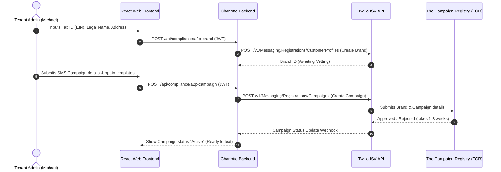

# Outbound Calling & SMS Telecom Specification
## Architecture, Carrier Regulations, and Multi-Tenant Programmatic Flows

This specification outlines the technical, operational, and regulatory requirements to expand the **Charlotte AI Receptionist** platform from an inbound-only system to support outbound dialing (such as automated appointment reminders, customer callbacks, and SMS notifications). 

---

## 1. The Regulatory Landscape: SMS vs. Voice

Outbound communications in the United States and Canada are strictly regulated to protect consumers from spam and fraud. Any SaaS platform automating outbound calls or SMS must build programmatic verification and compliance gates into its tenant onboarding flows.

### 1.1. SMS: A2P 10DLC Compliance (Application-to-Person)
All SMS traffic sent from standard 10-digit long code numbers in the US is classified as A2P (Application-to-Person) and must be registered with the **Campaign Registry (TCR)**. 

To handle this programmatically for our tenants, we use the **Twilio ISV (Independent Software Vendor) Messaging Trust APIs**.



#### Verification Rules:
1.  **Legal Brand Vetting:** Tenants must provide their Legal Business Name, EIN (Employer Identification Number), and Physical Address. Twilio submits this to databases (like Dun & Bradstreet) to verify the business exists.
2.  **Campaign Registry:** We must register the exact use-case (e.g., "Customer Care", "Appointment Confirmations").
3.  **Strict Consent (Opt-In):** The tenant's website or intake form must have a clear checkbox and opt-in disclosure (e.g., *"By checking this box, you agree to receive SMS alerts from Brown Consulting..."*).
4.  **Vetting Fees:** 
    *   Brand registration fee (one-time): ~$4.41 to $44.00 depending on vetting level.
    *   Campaign registration fee (one-time): ~$15.00.
    *   Campaign maintenance fee (monthly): ~$2.00 to $10.00/month.

### 1.2. Voice: SHAKEN/STIR Attestation
To prevent outbound calls from being automatically labeled as **"Scam Likely"** or blocked by major carriers (T-Mobile, AT&T, Verizon), outbound calls must carry a high level of **SHAKEN/STIR** attestation.

*   **A-Level Attestation (Full):** The carrier (Twilio) knows the caller and knows they are authorized to use this telephone number. Since we provision the numbers directly on Twilio, Twilio automatically signs outbound calls with A-level attestation.
*   **B-Level Attestation (Partial):** The carrier knows the caller, but cannot verify if they are officially authorized to use the caller ID. This occurs if a customer uses our outbound dialer but spoof-sets their "From" number to a number hosted elsewhere (BYON).
*   **C-Level Attestation (Gateway):** The carrier just forwards the call. High risk of call-blocking.

---

## 2. Technical Outbound Voice Pipeline

To programmatically trigger an outbound call, Charlotte's server must initiate the call via the Twilio REST API and then bridge the call to our Google ADK stream.

```mermaid
sequenceDiagram
    autonumber
    participant Server as Charlotte Backend
    participant Twilio as Twilio REST API
    actor Client as Customer Phone
    participant ADK as Google ADK / Gemini Live

    Note over Server: Trigger outbound appointment reminder
    Server->>Twilio: POST /v1/Accounts/{Sid}/Calls {To: "+15125550202", From: "+15125550199", MachineDetection: "Enable"}
    Twilio->>Client: Dials customer line
    Client->>Client: Customer answers and says "Hello?"
    Twilio-->>Server: Inbound Webhook (Customer Answered, MachineDetection: "Human")
    
    Server->>Twilio: Respond with TwiML <Connect><Stream url="..."/></Connect>
    Twilio<-->>ADK: Establish real-time WebSocket μ-law stream
    ADK->>Client: Charlotte speaks: "Hi Michael, this is Charlotte from Brown Consulting..."
```

### 2.1. Answering Machine Detection (AMD)
Outbound agents must handle cases where a robot answers instead of a human. When calling, we pass Twilio's `MachineDetection` parameter set to `'Enable'` or `'DetectMessageEnd'`:

```typescript
const call = await twilioClient.calls.create({
  to: '+15125550202',
  from: '+15125550199', // Charlotte's provisioned tenant number
  url: `${process.env.CHARLOTTE_API_BASE_URL}/api/webhook/twilio/outbound-connected`,
  machineDetection: 'Enable', // Twilio AMD
  asyncAmd: 'true', // Perform AMD asynchronously to reduce voice latency
  asyncAmdStatusCallback: `${process.env.CHARLOTTE_API_BASE_URL}/api/webhook/twilio/amd-callback`
});
```

#### AMD Webhook Responses:
The backend webhook receives an `AnsweredBy` parameter with one of these values:
1.  `human`: A live voice answered. Respond with `<Connect><Stream>` to engage the live Google ADK receptionist.
2.  `machine_start`: An answering machine was detected. 
    *   *Action:* Instruct Charlotte to wait until the message end (using TwiML `<Play>` or wait events) and then synthesize and "leave" a message, or simply hang up.
3.  `fax`: Fax tone. Hang up.
4.  `unknown`: Could not determine. Connect anyway or route to voice mail.

---

## 3. Outbound BYON (Caller ID Verification)

If an enterprise client uses their own number (BYON) but wants Charlotte to make outbound calls displaying their public business number as the Caller ID, we must verify ownership to satisfy carrier anti-spoofing requirements:

1.  **Verification API Call:**
    ```typescript
    const verification = await twilioClient.validationRequests.create({
      friendlyName: "Michael's Office Number",
      phoneNumber: "+15125551111" // The customer's existing BYON number
    });
    // Twilio returns validation code (e.g. "482029")
    ```
2.  **Validation Call:** Twilio calls `+15125551111`. The tenant admin answers and inputs the 6-digit code on their keypad.
3.  **Active Caller ID:** Once verified, the number is stored as a `Verified Caller ID` under our Twilio Account SID, enabling us to set `From: "+15125551111"` on outbound API calls.

---

## 4. Multi-Tenant Cost Isolation and Rate Limiting

Making outbound calls creates billing risks because compromised tenant accounts could be hijacked by fraudsters to dial high-cost international premium numbers (toll fraud).

### 4.1. Security Defenses Required
*   **Strict Toll Fraud Blocking:** Disable international dialing by default on Twilio. Lock dial scopes to local country regions (e.g., US/CA only).
*   **Outbound Rate Limiting:** Enforce a sliding-window rate limit on outbound calling APIs using Redis (e.g., max 10 outbound calls initiated per minute per tenant).
*   **Usage Credits:** Require prepaid account balances or strict monthly minute limits for standard SaaS subscription tiers. Outbound calls are terminated automatically when the quota is exhausted.
